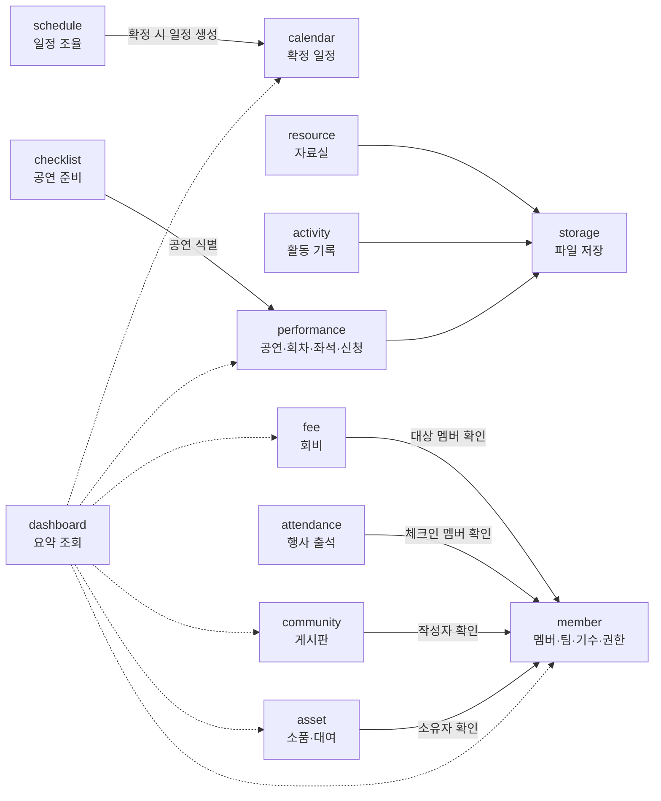
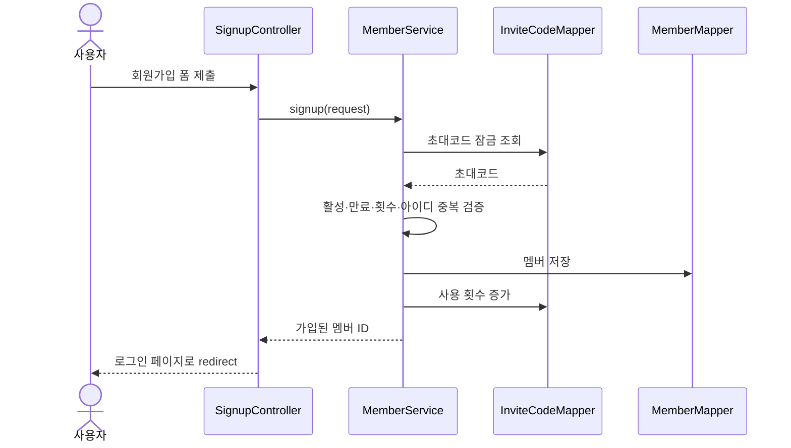
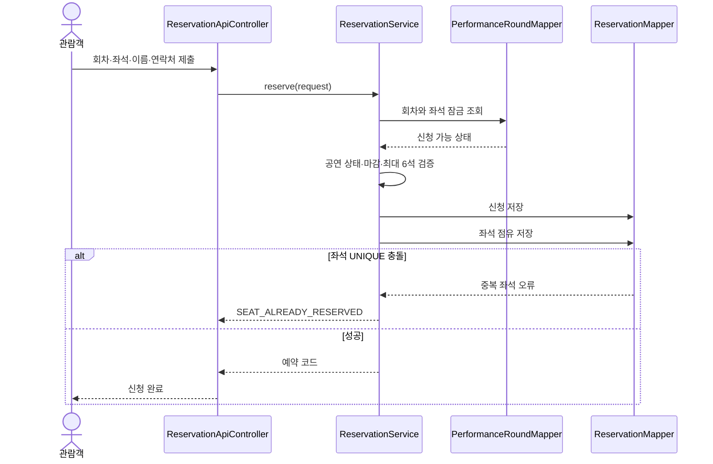

# bandi 백엔드 예시 설계

> **역사적 초안**: 이 문서는 공연·관람·회비·행사·출석을 포함한 이전
> 제품 범위를 설명한다. 해당 서비스는 2026-07-21에 폐기됐으며 구현
> 근거로 사용할 수 없다. 현재 폐기 범위는
> [retired-services.md](retired-services.md)를 따른다.

> 문서 상태: 기능 정의서 기반 설계 초안
> 기준 문서: `docs/feature-spec.md`
> 작성 기준일: 2026-07-16

> **개정 주의:** 이 문서의 폼 로그인·초대코드·일정 조율·커뮤니티 설계는 폐기 전 목업을 기준으로 하므로 신규 구현 근거로 사용하지 않는다. 2026-07-18 확정 기능은 `docs/feature-spec.md`와 `docs/database-schema.md`를 우선한다. 온보딩은 후속 범위이며 현재 구현 근거로 사용하지 않는다.

## 1. 목적과 전제

이 문서는 현재 화면 프로토타입의 기능을 실제 Spring Boot 백엔드로 구현할 때 사용할 수 있는 예시 설계다.
확정된 구현 명세가 아니라 도메인 경계, 데이터 구조, 트랜잭션과 권한 정책을 논의하기 위한 초안이다.

현재 단계에서는 다음을 가정한다.

- 하나의 반디 동아리만 운영한다. 다중 동아리 지원은 1차 범위에서 제외한다.
- 인증은 Spring Security와 JDBC 세션을 사용하는 폼 로그인 방식이다.
- 화면은 JSP 기반 SSR을 기본으로 하고, 좌석 선택·체크리스트 등 부분 갱신만 `/api`를 사용한다.
- 모든 날짜와 회차는 고정 샘플이 아니라 DB 데이터로 관리한다.
- 외부 관람객은 계정을 만들지 않고 신청자 정보로 관람을 신청한다.
- 파일은 DB에 바이너리로 넣지 않고 외부 또는 로컬 스토리지에 저장하며 DB에는 메타데이터만 둔다.

## 2. 설계 방향

### 2.1 기본 구조

프로젝트 컨벤션에 따라 package-by-feature와 다음 의존 방향을 사용한다.

```text
Controller → Service → Mapper → Model
                 │
                 └── 다른 feature의 Service
```

- Controller는 요청 검증, 로그인 사용자 식별, 뷰·리다이렉트 결정만 담당한다.
- Service는 트랜잭션과 유스케이스 흐름을 담당한다.
- Model은 역할 판단, 상태 전이, 수량·마감 검증 같은 비즈니스 규칙을 가진다.
- Mapper는 해당 feature의 데이터만 저장·조회한다.
- feature 사이 협력은 Service를 통해서만 수행한다.

### 2.2 SSR과 API의 역할

| 처리 유형 | 권장 방식 | 예시 |
|---|---|---|
| 페이지 조회 | SSR Controller | 홈, 멤버 목록, 회비 화면 |
| 일반 폼 등록·수정 | POST 후 PRG | 회원가입, 공연 등록, 행사 생성 |
| 즉시 상태 변경 | 세션 기반 API | 체크리스트 완료, 입장 처리, 좋아요 |
| 상호작용이 많은 화면 | 조회·변경 API | 좌석 현황, 일정 조율 시간표 |
| 파일 전송 | multipart/form-data | 자료 업로드, 활동 사진 |

상태 변경 API도 세션 인증과 CSRF 보호를 그대로 적용한다.

## 3. 도메인 구성

### 3.1 feature 목록

| feature | 책임 | 대표 모델 |
|---|---|---|
| `member` | 로그인 계정, 멤버, 역할, 팀, 기수, 초대코드 | `Member`, `Team`, `Cohort`, `InviteCode` |
| `calendar` | 확정된 동아리 일정 | `CalendarEvent` |
| `schedule` | 후보 시간 수집과 일정 추천 | `SchedulePoll`, `ScheduleOption`, `ScheduleResponse` |
| `resource` | 자료실 파일과 중요 자료 | `Resource` |
| `activity` | 팀별 활동 기록과 사진 | `ActivityLog` |
| `community` | 게시글, 공지, 좋아요, 댓글 | `Post`, `PostLike`, `Comment` |
| `asset` | 공용 소품·장비와 개인 대여 물품 | `AssetItem`, `BorrowRecord` |
| `performance` | 공연, 회차, 좌석, 신청, 입장 | `Performance`, `PerformanceRound`, `Reservation` |
| `checklist` | 공연별 팀 준비 항목 | `ChecklistItem` |
| `attendance` | 회식·MT 등 행사와 체크인 | `ClubEvent`, `AttendanceCheckIn` |
| `fee` | 회비 항목, 대상자, 납부 처리 | `FeeItem`, `FeeTarget` |
| `storage` | 저장 파일 메타데이터와 파일 저장 추상화 | `StoredFile` |
| `dashboard` | 여러 feature의 요약 조회 전용 모델 | `DashboardResponse` |

### 3.2 feature 관계



화살표는 Service 간 호출 방향이다. `dashboard`는 상태를 변경하지 않는 조회 전용 feature로 두며 전용 조회 DTO를 반환한다.

## 4. 패키지 예시

```text
kr.ac.tukorea.bandi
├── domain
│   ├── member
│   │   ├── controller
│   │   │   ├── docs
│   │   │   ├── LoginController.java
│   │   │   ├── SignupController.java
│   │   │   └── MemberController.java
│   │   ├── service
│   │   │   ├── MemberService.java
│   │   │   └── InviteCodeService.java
│   │   ├── mapper
│   │   ├── model
│   │   ├── dto/request
│   │   ├── dto/response
│   │   └── exception
│   ├── performance
│   │   ├── controller
│   │   ├── service
│   │   │   ├── PerformanceService.java
│   │   │   └── ReservationService.java
│   │   ├── mapper
│   │   ├── model
│   │   ├── dto/request
│   │   ├── dto/response
│   │   └── exception
│   └── {calendar,schedule,resource,...}
└── global
    ├── config
    ├── security
    └── exception
```

모델 수가 많더라도 처음부터 `command`, `query`, `repository` 같은 추가 계층을 만들지 않는다. 조회가 복잡해지는 feature만 `~QueryService`를 분리한다.

## 5. 데이터베이스 설계

### 5.1 공통 원칙

- PK는 `{table}_id BIGINT AUTO_INCREMENT`를 사용한다.
- 상태와 역할은 MySQL ENUM이 아닌 `VARCHAR`로 저장한다.
- 모든 테이블에 `created_dttm`, `updated_dttm`을 둔다.
- 사용자 작성 콘텐츠와 주요 마스터 데이터에는 `deleted_dttm`을 두고 소프트 삭제한다.
- 금액은 원 단위 `BIGINT`, 시간은 `DATETIME(6)` 또는 `DATE`·`TIME`으로 저장한다.
- 전화번호는 화면에서 마스킹하고 접근 로그에 남기지 않는다.

### 5.2 멤버와 인증

프로토타입의 `account`와 `member` 배열은 실제 설계에서 하나의 `member`로 통합한다. 그래야 운영진이 추가한 멤버와 로그인 계정이 분리되지 않는다.

#### `team`

| 컬럼 | 타입 | 설명 |
|---|---|---|
| `team_id` | BIGINT PK | 팀 식별자 |
| `name` | VARCHAR(50) | 팀명, 활성 데이터 내 UNIQUE |
| `display_order` | INT | 화면 정렬 순서 |
| `is_active` | TINYINT(1) | 사용 여부 |

#### `cohort`

| 컬럼 | 타입 | 설명 |
|---|---|---|
| `cohort_id` | BIGINT PK | 기수 식별자 |
| `name` | VARCHAR(30) | `26-2기` 등, UNIQUE |
| `is_active` | TINYINT(1) | 모집·운영 여부 |

#### `member`

| 컬럼 | 타입 | 설명 |
|---|---|---|
| `member_id` | BIGINT PK | 멤버 식별자 |
| `login_id` | VARCHAR(50) | 로그인 아이디, UNIQUE |
| `password_hash` | VARCHAR(255) | DelegatingPasswordEncoder 결과 |
| `name` | VARCHAR(50) | 이름 |
| `team_id` | BIGINT FK | 소속 팀 |
| `cohort_id` | BIGINT FK | 가입 기수 |
| `role` | VARCHAR(20) | `PRESIDENT`, `STAFF`, `LEADER`, `MEMBER` 중 확정값 |
| `status` | VARCHAR(20) | `ACTIVE`, `INACTIVE`, `WITHDRAWN` |
| `last_login_dttm` | DATETIME(6) NULL | 마지막 로그인 시각 |

권장 제약·인덱스:

- `uk_member_login_id(login_id)`
- `idx_member_team_id(team_id)`
- `idx_member_cohort_id(cohort_id)`
- `idx_member_status(status)`

#### `invite_code`

| 컬럼 | 타입 | 설명 |
|---|---|---|
| `invite_code_id` | BIGINT PK | 초대코드 식별자 |
| `code` | VARCHAR(40) | 추측하기 어려운 코드, UNIQUE |
| `cohort_id` | BIGINT FK | 가입 시 배정할 기수 |
| `created_by` | BIGINT FK | 생성 운영진 |
| `is_active` | TINYINT(1) | 사용 가능 여부 |
| `expires_dttm` | DATETIME(6) NULL | 만료 시각 |
| `max_usage_count` | INT NULL | 최대 사용 횟수 |
| `used_count` | INT | 사용 횟수 |

회원가입 트랜잭션에서 초대코드를 잠금 조회한 뒤 활성·만료·사용 횟수를 검증하고 멤버 생성과 사용 횟수 증가를 함께 커밋한다.

### 5.3 캘린더와 일정 조율

#### `calendar_event`

| 컬럼 | 타입 | 설명 |
|---|---|---|
| `calendar_event_id` | BIGINT PK | 일정 식별자 |
| `title` | VARCHAR(100) | 일정명 |
| `team_id` | BIGINT FK NULL | 담당 팀, NULL이면 전체 일정 |
| `start_dttm` | DATETIME(6) | 시작 시각 |
| `end_dttm` | DATETIME(6) NULL | 종료 시각 |
| `place` | VARCHAR(150) NULL | 장소 |
| `created_by` | BIGINT FK | 등록자 |
| `schedule_poll_id` | BIGINT NULL | 일정 조율에서 생성된 경우 원본 식별자 |

`start_dttm`에 인덱스를 두어 월간 범위 조회를 처리한다. 연·월 없는 일자만 저장하는 구조는 사용하지 않는다.

#### `schedule_poll`

| 컬럼 | 타입 | 설명 |
|---|---|---|
| `schedule_poll_id` | BIGINT PK | 조율 식별자 |
| `title` | VARCHAR(100) | 조율 제목 |
| `status` | VARCHAR(20) | `OPEN`, `CONFIRMED`, `CLOSED` |
| `response_deadline_dttm` | DATETIME(6) NULL | 응답 마감 |
| `created_by` | BIGINT FK | 생성자 |
| `confirmed_option_id` | BIGINT NULL | 확정된 후보 |

#### `schedule_option`

| 컬럼 | 타입 | 설명 |
|---|---|---|
| `schedule_option_id` | BIGINT PK | 후보 식별자 |
| `schedule_poll_id` | BIGINT FK | 조율 |
| `start_dttm` | DATETIME(6) | 후보 시작 시각 |
| `end_dttm` | DATETIME(6) NULL | 후보 종료 시각 |

#### `schedule_response`

| 컬럼 | 타입 | 설명 |
|---|---|---|
| `schedule_response_id` | BIGINT PK | 응답 식별자 |
| `schedule_option_id` | BIGINT FK | 후보 시간 |
| `member_id` | BIGINT FK | 응답 멤버 |
| `is_available` | TINYINT(1) | 가능 여부 |

`uk_schedule_response_option_member(schedule_option_id, member_id)`로 한 후보에 한 멤버의 응답이 하나만 존재하게 한다.

### 5.4 자료·활동·커뮤니티

#### `stored_file`

| 컬럼 | 타입 | 설명 |
|---|---|---|
| `stored_file_id` | BIGINT PK | 파일 식별자 |
| `original_name` | VARCHAR(255) | 사용자 파일명 |
| `storage_key` | VARCHAR(500) | 실제 저장소 키, UNIQUE |
| `content_type` | VARCHAR(100) | MIME 타입 |
| `size_bytes` | BIGINT | 파일 크기 |
| `uploaded_by` | BIGINT FK NULL | 업로더, 공개 업로드면 NULL 가능 |

#### `resource`

- `resource_id`, `stored_file_id`, `category`, `title`, `is_pinned`, `uploaded_by`, 공통 컬럼
- 카테고리: `SCRIPT`, `MINUTES`, `PROMOTION`, `PERFORMANCE_VIDEO`, `PRACTICE_VIDEO`, `ETC`
- 중요 공지는 별도 자료 타입을 만들지 않고 `is_pinned`으로 표현한다.

#### `activity_log`, `activity_attachment`

- `activity_log`: 팀, 활동일, 참여 인원, 내용, 작성자
- `activity_attachment`: 활동 기록과 저장 파일의 연결
- 활동 기록 저장과 첨부 메타데이터 연결은 하나의 DB 트랜잭션으로 처리한다.

#### `post`, `post_like`, `comment`

- `post`: 카테고리, 제목, 본문, 작성자, 고정 여부
- `post_like`: 게시글과 멤버 연결, `(post_id, member_id)` UNIQUE
- `comment`: 게시글, 작성자, 본문, 부모 댓글 식별자(답글이 필요할 때)
- 좋아요는 단순 증가가 아니라 사용자별 토글로 처리해 중복 집계를 방지한다.

### 5.5 소품과 개인 대여

#### `asset_item`

| 컬럼 | 타입 | 설명 |
|---|---|---|
| `asset_item_id` | BIGINT PK | 품목 식별자 |
| `name` | VARCHAR(100) | 품목명 |
| `category` | VARCHAR(30) | 소품·의상·조명·음향 등 |
| `total_quantity` | INT | 총수량 |
| `in_use_quantity` | INT | 사용 중 수량 |
| `storage_location` | VARCHAR(150) | 보관 위치 |
| `status` | VARCHAR(20) | `NORMAL`, `IN_USE`, `REPAIR` |

Model은 `0 <= in_use_quantity <= total_quantity`를 항상 보장한다.

#### `borrow_record`

- `borrow_record_id`, `item_name`, `owner_member_id`, `borrowed_by`, `borrowed_date`, `due_date`, `returned_dttm`
- 프로토타입의 `공연 후` 같은 자유문자 입력이 필요하다면 `due_note`를 별도로 둔다.
- 반납은 레코드 삭제가 아니라 `returned_dttm` 기록으로 처리한다.

### 5.6 공연·회차·좌석·신청

공연 신청은 동시 요청이 발생할 수 있으므로 화면 기능 중 가장 강한 데이터 제약이 필요하다.

#### `performance`

| 컬럼 | 타입 | 설명 |
|---|---|---|
| `performance_id` | BIGINT PK | 공연 식별자 |
| `title` | VARCHAR(150) | 공연명 |
| `place` | VARCHAR(150) | 장소 |
| `age_rating` | VARCHAR(50) NULL | 관람 연령 |
| `runtime_minutes` | INT NULL | 러닝타임 |
| `status` | VARCHAR(20) | `PREPARING`, `OPEN`, `CLOSED` |
| `description` | TEXT | 작품 소개 |
| `poster_file_id` | BIGINT FK NULL | 포스터 이미지 |

#### `performance_round`

| 컬럼 | 타입 | 설명 |
|---|---|---|
| `performance_round_id` | BIGINT PK | 회차 식별자 |
| `performance_id` | BIGINT FK | 공연 |
| `starts_dttm` | DATETIME(6) | 공연 시작 시각 |
| `reservation_opens_dttm` | DATETIME(6) NULL | 신청 시작 |
| `reservation_closes_dttm` | DATETIME(6) NULL | 신청 마감 |
| `seat_map_code` | VARCHAR(50) | 좌석 배치 식별 코드 |

#### `performance_seat`

| 컬럼 | 타입 | 설명 |
|---|---|---|
| `performance_seat_id` | BIGINT PK | 회차별 좌석 식별자 |
| `performance_round_id` | BIGINT FK | 회차 |
| `seat_label` | VARCHAR(20) | `A3` 등 |
| `row_no` | INT | 화면 행 순서 |
| `column_no` | INT | 화면 열 순서 |
| `status` | VARCHAR(20) | `AVAILABLE`, `BLOCKED` |

`uk_performance_seat_round_label(performance_round_id, seat_label)`을 둔다.

#### `reservation`

| 컬럼 | 타입 | 설명 |
|---|---|---|
| `reservation_id` | BIGINT PK | 신청 식별자 |
| `performance_round_id` | BIGINT FK | 신청 회차 |
| `reservation_code` | VARCHAR(40) | 외부 조회·취소용 임의 코드, UNIQUE |
| `applicant_name` | VARCHAR(50) | 신청자명 |
| `phone` | VARCHAR(30) | 연락처 |
| `status` | VARCHAR(20) | `CONFIRMED`, `CANCELLED` |
| `checked_in_dttm` | DATETIME(6) NULL | 입장 시각 |

#### `reservation_seat`

| 컬럼 | 타입 | 설명 |
|---|---|---|
| `reservation_seat_id` | BIGINT PK | 신청 좌석 식별자 |
| `reservation_id` | BIGINT FK | 신청 |
| `performance_seat_id` | BIGINT FK | 좌석 |

활성 신청에 대한 좌석 중복을 DB에서 막아야 한다. MySQL에서 조건부 UNIQUE를 직접 표현하기 어려우므로 다음 중 하나를 선택한다.

1. 취소 시 `reservation_seat`을 하드 삭제하고 `performance_seat_id`에 UNIQUE를 둔다.
2. 좌석 점유 테이블을 별도로 두고 활성 점유만 유지한다.

1차 구현은 1번이 단순하다. 신청 이력은 `reservation`에 남고 좌석 점유만 해제된다.

### 5.7 체크리스트와 출석

#### `checklist_item`

- `checklist_item_id`, `performance_id`, `team_id`, `content`, `is_completed`, `completed_by`, `completed_dttm`
- 공연별로 분리해 이전 공연의 체크리스트가 다음 공연에 섞이지 않게 한다.
- 완료 권한은 정책 확정 후 `본인 팀만` 또는 `전체 부원` 중 하나로 Service에서 검증한다.

#### `club_event`, `attendance_check_in`

- `club_event`: 행사명, 시작 시각, 장소, 상태, 생성자
- `attendance_check_in`: 행사, 멤버, 체크인 시각, 체크인 방식
- `uk_attendance_check_in_event_member(club_event_id, member_id)`로 중복 체크인을 막는다.

### 5.8 회비

회비는 현재 멤버 목록을 매번 동적으로 대조하지 않고 항목 생성 시 대상자를 확정한다. 그래야 나중에 가입한 멤버가 과거 회비의 미납자로 자동 포함되지 않는다.

#### `fee_item`

- `fee_item_id`, `name`, `amount`, `reference_period`, `due_date`, `status`, `created_by`
- 상태: `OPEN`, `CLOSED`, `CANCELLED`

#### `fee_target`

- `fee_target_id`, `fee_item_id`, `member_id`, `payment_status`, `paid_dttm`, `processed_by`
- `(fee_item_id, member_id)` UNIQUE
- 납부 상태: `UNPAID`, `PAID`
- 납부 취소는 행 삭제가 아니라 상태와 처리자를 갱신한다.

감사 이력이 필요해지면 `fee_payment_history`를 추가하되 1차 구현에서는 운영 로그로 시작할 수 있다.

## 6. 핵심 유스케이스와 트랜잭션

### 6.1 초대코드 회원가입



- 멤버 생성과 초대코드 사용 횟수 증가는 하나의 트랜잭션이다.
- 비밀번호는 Controller 진입 이후 평문 로그를 남기지 않고 PasswordEncoder로 즉시 해시한다.

### 6.2 일정 조율 확정

1. 팀장·운영진 권한과 조율의 `OPEN` 상태를 확인한다.
2. 응답 수가 가장 많은 후보를 계산하되 운영자가 다른 후보를 선택할 수도 있게 한다.
3. `SchedulePoll.confirm(optionId)`로 상태 전이를 검증한다.
4. `CalendarService.createFromSchedulePoll(...)`을 호출해 실제 일정을 생성한다.
5. 일정 ID와 확정 후보를 저장하고 함께 커밋한다.

동일 조율을 두 번 확정해 일정이 중복 생성되지 않도록 `calendar_event.schedule_poll_id`에 UNIQUE를 둔다.

### 6.3 좌석 신청



- 애플리케이션의 사전 조회만 믿지 않고 DB UNIQUE 제약으로 최종 중복을 차단한다.
- 신청과 모든 좌석 점유는 하나의 트랜잭션으로 처리한다.
- 신청 취소는 신청 상태 변경과 좌석 점유 해제를 함께 처리한다.

### 6.4 회비 일괄 납부 처리

1. 운영진 권한을 확인한다.
2. 회비 항목이 `OPEN`인지 확인한다.
3. 전달받은 멤버 ID가 해당 회비의 대상자인지 조회한다.
4. 선택 대상의 상태를 `PAID`, 처리 시각과 처리자를 갱신한다.
5. 일부만 처리되는 일이 없도록 한 트랜잭션으로 커밋한다.

## 7. URL과 컨트롤러 예시

### 7.1 SSR 화면

| Method | URL | 역할 | 설명 |
|---|---|---|---|
| GET | `/login` | 공개 | 로그인 화면 |
| GET, POST | `/signup` | 공개 | 회원가입 화면·처리 |
| GET | `/` | 로그인 | 역할별 홈 |
| GET | `/calendar` | 로그인 | 월간 일정 |
| GET | `/schedule-polls/{pollId}` | 로그인 | 일정 조율 상세 |
| GET | `/resources` | 로그인 | 자료실 |
| GET | `/community/posts` | 로그인 | 게시글 목록 |
| GET | `/assets` | 로그인 | 소품·장비 목록 |
| GET | `/performances/{performanceId}/reserve` | 공개 | 관람 신청 화면 |
| GET | `/admin/performances` | 운영진 | 공연 운영 |
| GET | `/admin/reservations` | 운영진 | 신청 명단 |
| GET | `/fees` | 로그인 | 본인 또는 운영진 회비 화면 |
| GET | `/admin/members` | 운영진 | 멤버·권한 화면 |

폼 POST는 같은 리소스의 복수형 URL을 사용하고 성공 시 PRG로 리다이렉트한다.

### 7.2 상호작용 API

| Method | URL | 역할 | 설명 |
|---|---|---|---|
| GET | `/api/performance-rounds/{roundId}/seats` | 공개 | 회차 좌석 현황 |
| POST | `/api/reservations` | 공개 | 좌석 신청 |
| POST | `/api/schedule-polls/{pollId}/responses` | 로그인 | 내 가능 시간 저장 |
| POST | `/api/schedule-polls/{pollId}/confirmation` | 팀장·운영진 | 후보 확정 |
| PUT | `/api/checklist-items/{itemId}/completion` | 정책에 따른 구성원 | 완료 상태 변경 |
| PUT | `/api/reservations/{reservationId}/check-in` | 운영진 | 입장 처리 |
| DELETE | `/api/reservations/{reservationId}/check-in` | 운영진 | 입장 취소 |
| PUT | `/api/posts/{postId}/like` | 로그인 | 좋아요 설정 |
| DELETE | `/api/posts/{postId}/like` | 로그인 | 좋아요 취소 |
| POST | `/api/events/{eventId}/check-ins` | 로그인 | 본인 행사 체크인 |
| PUT | `/api/fees/{feeItemId}/targets/payment-status` | 운영진 | 선택 대상 납부 상태 변경 |

공개 신청 API도 CSRF를 예외 처리하지 않는다. 공개 신청 폼을 먼저 렌더링해 발급된 CSRF 토큰을 제출하도록 한다.

## 8. 권한 정책 예시

프로토타입의 `member`, `leader`, `admin` 세 역할은 프로젝트 컨벤션의 실제 권한 이름과 먼저 통일해야 한다. 예시는 다음과 같다.

| 권한 | 의미 |
|---|---|
| `ROLE_MEMBER` | 일반 부원 |
| `ROLE_LEADER` | 팀장 |
| `ROLE_STAFF` | 운영진 |
| `ROLE_PRESIDENT` | 회장, 최고 운영 권한 |

권장 규칙:

- 조회 화면은 로그인 멤버에게 기본 허용한다.
- 팀별 데이터 편집은 `LEADER`가 자기 팀만, `STAFF` 이상이 전체 팀을 관리한다.
- 공연, 관람객 개인정보, 회비, 멤버 권한은 `STAFF` 이상만 관리한다.
- 운영진 권한 부여와 회수는 `PRESIDENT`만 허용하는 방안을 권장한다.
- 자기 자신의 마지막 최고 관리자 권한을 제거할 수 없게 한다.
- URL 인가와 Service의 대상 데이터 인가를 모두 적용한다.

예를 들어 팀장이 일정 수정 URL에 접근할 수 있더라도, Service에서 일정의 `teamId`와 로그인 멤버의 `teamId`를 다시 비교한다.

## 9. 오류 코드 예시

| 코드 | 오류 |
|---|---|
| `M001` | 멤버를 찾을 수 없음 |
| `M002` | 로그인 아이디 중복 |
| `M003` | 사용할 수 없는 초대코드 |
| `M004` | 초대코드 사용 한도 초과 |
| `S001` | 일정 조율을 찾을 수 없음 |
| `S002` | 마감된 일정 조율 |
| `P001` | 공연 또는 회차를 찾을 수 없음 |
| `P002` | 신청 기간이 아님 |
| `P003` | 이미 신청된 좌석 |
| `P004` | 좌석 선택 수 초과 |
| `F001` | 회비 항목을 찾을 수 없음 |
| `F002` | 마감된 회비 항목 |
| `A001` | 소품 수량이 올바르지 않음 |
| `C001` | 입력값이 올바르지 않음 |
| `C002` | 권한 없음 |

메시지는 사용자에게 노출 가능한 문장으로 관리하고 내부 SQL이나 개인정보를 포함하지 않는다.

## 10. 조회와 성능

- 캘린더는 `start_dttm` 범위와 선택 팀으로 한 번에 조회한다.
- 게시글·자료·멤버·신청 명단은 처음부터 페이지네이션한다.
- 대시보드는 각 화면 전체 목록을 불러오지 않고 건수와 최근 N건만 조회한다.
- 회비 현황은 대상자별 상태를 조인해 가져오며 멤버마다 쿼리를 반복하지 않는다.
- 좌석 현황은 회차의 전체 좌석과 활성 점유를 한 번에 조회한다.
- 목록 검색 조건과 정렬값은 DTO로 받고 정렬 SQL은 `<choose>` 화이트리스트를 사용한다.

## 11. 보안과 개인정보

- 비밀번호는 DelegatingPasswordEncoder의 bcrypt 기본값으로 저장한다.
- 세션에는 `memberId`와 권한 등 최소 식별 정보만 저장한다.
- 모든 상태 변경 요청에 CSRF 검증을 적용한다.
- 신청자 연락처는 운영진에게만 노출하고 일반 로그·예외 메시지에는 기록하지 않는다.
- 신청 명단 CSV는 운영진 권한을 확인한 뒤 서버에서 생성한다.
- 업로드 파일의 확장자만 신뢰하지 않고 MIME 타입, 크기, 허용 형식을 검증한다.
- 사용자 입력 파일명은 저장소 경로로 직접 사용하지 않고 임의 `storage_key`를 발급한다.
- 게시글·파일명 등 사용자 입력은 JSP에서 `<c:out>`으로 출력한다.
- 운영진의 권한 변경, 회비 처리, 관람객 입장 처리는 감사 로그 대상이다.

## 12. 구현 순서 예시

전체 기능을 한 번에 만들기보다 의존성이 적고 핵심 흐름을 검증할 수 있는 순서로 진행한다.

### 1단계: 운영 기반

1. `member`: 로그인, 회원가입, 초대코드, 역할
2. `calendar`: 월간 일정 조회·등록
3. `dashboard`: 로그인 사용자와 일정 중심 최소 홈

### 2단계: 동아리 운영 MVP

4. `schedule`: 가능 시간 응답과 일정 확정
5. `community`: 공지·일반 글
6. `asset`: 소품 조회·관리
7. `checklist`: 공연별 준비 항목
8. `attendance`: 행사와 자가 체크인
9. `fee`: 회비 항목과 수기 납부 관리

### 3단계: 공연 신청

10. `performance`: 공연·회차·좌석 설정
11. 공개 좌석 신청과 신청 조회·취소 정책
12. 운영진 신청 명단과 입장 처리

### 4단계: 파일과 부가 기능

13. `storage`와 `resource`
14. `activity`와 사진 첨부
15. 댓글, 알림, CSV, 감사 로그 고도화

## 13. 구현 전 결정이 필요한 항목

1. 역할을 `MEMBER/LEADER/STAFF/PRESIDENT` 네 단계로 확정할지
2. 팀장이 자기 팀 데이터만 수정할지 전체 팀을 수정할지
3. 멤버를 운영진이 먼저 만들고 계정을 활성화할지, 초대코드 가입만 허용할지
4. 일정 조율 생성자와 응답 대상자를 누구로 할지
5. 일반 부원이 모든 체크리스트 상태를 변경할 수 있는지
6. 공연 좌석 배치를 공연마다 설정할지 공통 공연장 템플릿을 사용할지
7. 관람 신청 조회·취소 인증을 예약 코드로 할지 연락처 추가 검증을 할지
8. 좌석 임시 선점 시간이 필요한지 즉시 확정만 지원할지
9. 회비 대상자를 전체·기수·선택 멤버 중 어떤 방식으로 지정할지
10. 자료 파일 저장소를 로컬 볼륨, S3 호환 저장소 중 무엇으로 할지

이 항목이 결정되면 실제 ERD, API 요청·응답 명세와 feature별 TDD 테스트 목록을 확정할 수 있다.
