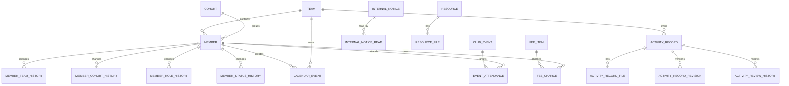
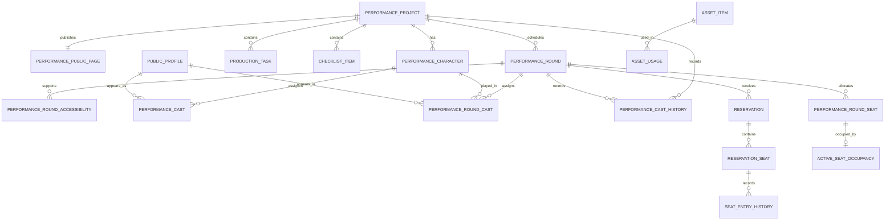

# bandi 데이터베이스 스키마 — 1차 구현 기준

> 문서 상태: 1차 구현 승인 기준선
> 작성 기준일: 2026-07-18
> 기준 문서: `feature-spec.md`, `performance-operations-plan.md`, `mockup-operations-review.md`
> 대상 DBMS: MySQL 8
> 주의: 이 문서는 Flyway 마이그레이션이 아니며, 미확정 정책을 DB에 고정하지 않는다.

## 1. 설계 결론

확정된 기능은 다음 여섯 영역으로 나눈다.

1. 멤버·학교 인증·권한
2. 캘린더·공시·공지·자료·활동 기록
3. 행사 출석·회비
4. 공연 제작·소품·체크리스트
5. 공개 공연·관람 신청·QR 입장
6. 공통 파일·감사 이력

홈은 각 기능의 데이터를 조회해 조합하는 화면이므로 별도 `dashboard` 테이블을 만들지 않는다. 폐기된 일정 조율과 커뮤니티 게시판 관련 테이블도 만들지 않는다.

학교 SSO 비밀번호, 학교 세션 쿠키와 학교 응답 원문은 어떤 테이블에도 저장하지 않는다. 운영진이 사전 등록한 `member`를 학번으로 연결하고 마지막 학적 확인 결과만 저장한다.

좌석 배치 생성·재사용 정책은 아직 확정되지 않았지만, 신청과 입장은 좌석을 참조해야 한다. 따라서 1차 스키마는 회차에 실제 배정된 좌석인 `performance_round_seat`만 계약으로 두고, 좌석 템플릿은 추후 추가한다.

### 1.1 확정 기능과 테이블 대응

| 확정 기능 | 정본 테이블 | 설계 판단 |
|---|---|---|
| 학교 SSO·멤버 권한 | `member`, `team`, `cohort`, 멤버 이력 | 로컬 계정·비밀번호 없음 |
| 홈 | 없음 | 각 도메인 집계 조회로 구성 |
| 통합 캘린더 | `calendar_event` | 일정 조율 원본 없음 |
| 공시 | `public_notice` | 외부 공식 콘텐츠로 분리 |
| 공지 | `internal_notice`, `internal_notice_read` | 조회수 없이 멤버별 읽음 기록 |
| 자료실 | `resource`, `resource_file`, `stored_file` | 공지와 탐색 UI만 공유 |
| 활동 기록 | `activity_record`, 파일·검수 이력 | 네이비즘 증빙 사진 필수 |
| 신입 부원 모집 | 별도 지원자 테이블 없음 | Google Form 유지, 합격자만 `member`에 사전 등록 |
| 온보딩 | 후속 설계만 보존 | 1차 마이그레이션에서 관련 테이블 생성 금지 |
| 행사·출석 | `club_event`, `event_attendance` | 참석 투표 없음 |
| 회비 | `fee_item`, `fee_charge`, 이력 | 수기 수납, 대상자 스냅샷 |
| 공연 제작 | `performance_project`, `production_task` | 학년도·학기별 하나, 팀 책임 |
| 소품·장비 | `asset_item`, `asset_unit`, `asset_usage` | 수량형과 개별형 모두 수용 |
| 공연 체크리스트 | `checklist_item`, 이력 | 프로젝트·회차 범위 구분 |
| 외부 공연 홍보 | 공개 페이지·캐스팅·제작진·미디어·관람 안내 | 내부 멤버와 공개 프로필 분리 |
| 관람 신청·입장 | 회차·좌석·신청·점유·입장 이력 | 예약 단위 QR, 좌석별 입장 |
| 일정 조율·커뮤니티 | 없음 | 폐기 범위이므로 테이블 생성 금지 |

## 2. 구현 컨벤션 동기화

확정 기획의 권한은 다음과 같다.

- `ADMIN`: 전체 운영
- `LEADER`: 소속 팀 관리
- `MEMBER`: 일반 부원

`docs/coding-convention.md` 18.2의 `ClubRole`과 Spring Security 권한 문자열은 위 세 역할에 맞춰 동기화했다. Java enum, DB `role_code`, 세션 권한과 서버 인가에서 다른 역할 문자열을 추가하지 않는다.

컨벤션 11.3에는 `ck_{table}_{meaning}` 형식, Java enum과 `CHECK` 동기화, generated column의 네이밍·허용 범위와 예약값 전제를 반영했다. 첫 마이그레이션부터 해당 규칙을 적용한다.

## 3. 공통 물리 규칙

### 3.1 네이밍과 타입

- 테이블은 소문자 snake_case 단수형을 사용한다.
- PK는 `{table}_id BIGINT AUTO_INCREMENT`를 사용한다.
- FK 컬럼은 참조 PK와 같은 이름을 사용하되 역할이 여러 개면 `created_by_member_id`처럼 의미를 붙인다.
- 상태와 종류는 MySQL ENUM이 아닌 `VARCHAR(30)` 코드로 저장한다.
- 금액은 원 단위 `BIGINT`를 사용한다.
- 날짜·시간은 KST 기준 `DATE`, `TIME`, `DATETIME(6)`을 사용한다.
- 장문 본문은 `LONGTEXT`, 짧은 설명은 `TEXT`를 기본으로 한다.
- boolean은 `is_` 접두사와 `TINYINT(1)`을 사용한다.
- 모든 FK에 조회 인덱스를 둔다.

### 3.2 공통 컬럼

모든 업무 테이블에 다음 컬럼을 둔다.

```sql
created_dttm DATETIME(6) NOT NULL DEFAULT CURRENT_TIMESTAMP(6),
updated_dttm DATETIME(6) NOT NULL DEFAULT CURRENT_TIMESTAMP(6)
    ON UPDATE CURRENT_TIMESTAMP(6)
```

사용자 작성 콘텐츠와 주요 마스터에는 다음 컬럼을 추가한다.

```sql
deleted_dttm DATETIME(6) NULL
```

이력·읽음·연결 테이블은 append-only 또는 관계 자체가 기록이므로 `deleted_dttm`을 두지 않는 것을 기본으로 한다.

### 3.3 FK와 삭제 정책

- 연결된 멤버, 공지, 회비, 활동 기록과 공연 기록은 물리 삭제하지 않고 상태 또는 `deleted_dttm`으로 종료한다.
- 업무 부모의 FK는 기본 `RESTRICT`로 두고 애플리케이션에서 종료 상태를 검증한다.
- 임시 점유처럼 현재 상태만 표현하는 테이블은 업무 트랜잭션 안에서 물리 삭제할 수 있다.
- 파일 메타데이터는 참조가 모두 해제돼도 즉시 삭제하지 않고 보존 정책에 따라 정리한다.

### 3.4 코드값 관리

1차 버전은 범용 코드 테이블을 만들지 않는다. 코드값은 Java enum과 DB `CHECK` 제약을 함께 사용한다.

- 장점: 의미 없는 범용 `code_group`, `code` 테이블과 런타임 조인을 피한다.
- 변경 시: Java enum, 신규 Flyway 마이그레이션의 `CHECK`, 문서를 같은 커밋에서 변경한다.

## 4. 전체 관계

### 4.1 멤버와 내부 운영



### 4.2 공연 제작과 관람



## 5. 멤버·학교 인증·권한

### 5.1 `team`

| 컬럼 | 타입 | NULL | 설명 |
|---|---|---|---|
| `team_id` | BIGINT PK | N | 팀 식별자 |
| `name` | VARCHAR(50) | N | 팀명 |
| `display_order` | INT | N | 화면 순서 |
| `is_active` | TINYINT(1) | N | 운영 여부 |

제약과 인덱스:

- `uk_team_name(name)`
- `idx_team_is_active_display_order(is_active, display_order)`

팀은 기록 보존을 위해 삭제하지 않고 비활성화한다.

현재 명단에서 확인된 팀값은 `연출`, `조연출`, `배우`, `무대팀`, `오퍼팀`, `디자인팀`, `영상팀`, `영상 배우`, `영상 촬영`, `영상 연출`, `영상 편집`이다. 1차 기준 데이터는 이 11개 값을 중복 제거해 그대로 등록하며, 운영진이 향후 조직을 통합하면 기존 팀을 비활성화하고 멤버를 새 팀으로 이동해 이력을 남긴다. 임의로 `조연출`을 `연출`에 합치거나 영상 세부 팀을 `영상팀` 하나로 정규화하지 않는다.

### 5.2 `cohort`

| 컬럼 | 타입 | NULL | 설명 |
|---|---|---|---|
| `cohort_id` | BIGINT PK | N | 기수 식별자 |
| `name` | VARCHAR(30) | N | 표시명, 예: `26-2기` |
| `admission_year` | SMALLINT | N | 가입 연도 |
| `term_code` | VARCHAR(20) | N | `FIRST`, `SECOND` |
| `is_active` | TINYINT(1) | N | 모집·운영 여부 |

- `uk_cohort_year_term(admission_year, term_code)`
- `uk_cohort_name(name)`
- `ck_cohort_term_code`: `FIRST`, `SECOND`만 허용

비활성 기수는 기존 멤버와 이력의 참조를 유지하지만, 신규 사전 등록과 기수 변경의 배정 대상으로 사용할 수 없다.

### 5.3 `member`

운영진 사전 등록과 SSO 연결 결과를 하나의 멤버 행에서 관리한다. 로컬 계정과 비밀번호 컬럼은 만들지 않는다.

| 컬럼 | 타입 | NULL | 설명 |
|---|---|---|---|
| `member_id` | BIGINT PK | N | 멤버 식별자 |
| `student_no` | VARCHAR(20) | N | 학교 학번, 로그인 연결 키 |
| `name` | VARCHAR(50) | N | 표시 이름 |
| `department` | VARCHAR(100) | Y | 마지막 학교 확인 학과 |
| `academic_status_code` | VARCHAR(30) | Y | `ENROLLED`, `LEAVE_OF_ABSENCE`, `GRADUATED`, `UNKNOWN` |
| `academic_status_verified_dttm` | DATETIME(6) | Y | 학교에서 확인한 시각 |
| `team_id` | BIGINT FK | N | 현재 소속 팀, 한 명당 하나 |
| `cohort_id` | BIGINT FK | N | 가입 기수 |
| `role_code` | VARCHAR(30) | N | `ADMIN`, `LEADER`, `MEMBER` |
| `member_status_code` | VARCHAR(30) | N | `PRE_REGISTERED`, `ACTIVE`, `SUSPENDED`, `WITHDRAWN`, `REGISTRATION_CANCELLED` |
| `sso_link_status_code` | VARCHAR(30) | N | `WAITING`, `LINKED`, `REVIEW_REQUIRED` |
| `sso_linked_dttm` | DATETIME(6) | Y | 최초 연결 시각 |
| `last_login_dttm` | DATETIME(6) | Y | 마지막 로그인 성공 시각 |
| `registered_by_member_id` | BIGINT FK | Y | 사전 등록 운영진, 초기 부트스트랩은 NULL 허용 |

제약과 인덱스:

- `uk_member_student_no(student_no)`
- `idx_member_team_status(team_id, member_status_code)`
- `idx_member_cohort_status(cohort_id, member_status_code)`
- `idx_member_sso_link_status(sso_link_status_code)`
- `role_code`는 세 값만 허용한다.
- `ck_member_academic_status_code`: 학교 라벨을 정규화한 네 학적 코드만 허용하며 SSO 확인 전에는 NULL이다.
- 운영진 사전 등록의 최초 권한은 항상 `MEMBER`다. `LEADER`, `ADMIN` 승격은 등록 후 별도 권한 변경 명령과 이력으로만 처리한다.
- 일반 내부 접근은 `academic_status_code = 'ENROLLED'`, `member_status_code = 'ACTIVE'`, `sso_link_status_code = 'LINKED'`를 모두 만족해야 한다.
- 온보딩 구현 전에는 사전 등록 정보가 일치한 최초 SSO 연결 트랜잭션에서 `PRE_REGISTERED → ACTIVE`, `WAITING → LINKED`로 전환하고 일반 세션을 생성한다. 이름·학번 대조가 불일치하면 활성화하지 않고 `REVIEW_REQUIRED`로 전환한다.
- 학교 학적 상태는 매 로그인 때 다시 확인하며 DB 값만 믿고 허용하지 않는다.

`member`는 학번 정체성의 정본이므로 소프트 삭제 후 같은 학번으로 새 행을 만들지 않는다. SSO 연결 전 오등록은 기존 행의 학번·이름·팀을 정정하거나 `REGISTRATION_CANCELLED`로 전환한다. 연결 전이고 다른 업무 FK가 전혀 없는 잘못된 행만 운영 도구에서 하드 삭제할 수 있다. 연결 후에는 `WITHDRAWN` 등 상태와 변경 이력으로 보존한다. 따라서 `uk_member_student_no(student_no)`는 유지한다.

### 5.4 멤버 변경 이력

#### `member_team_history`

- `member_team_history_id` PK
- `member_id` FK
- `previous_team_id` FK
- `new_team_id` FK
- `reason` VARCHAR(500)
- `changed_by_member_id` FK
- `changed_dttm` DATETIME(6)

#### `member_role_history`

- `member_role_history_id` PK
- `member_id` FK
- `previous_role_code`, `new_role_code` VARCHAR(30)
- `reason` VARCHAR(500)
- `changed_by_member_id` FK
- `changed_dttm` DATETIME(6)

#### `member_cohort_history`

- `member_cohort_history_id` PK
- `member_id` FK
- `previous_cohort_id`, `new_cohort_id` FK
- `reason` VARCHAR(500)
- `changed_by_member_id` FK
- `changed_dttm` DATETIME(6)

#### `member_status_history`

- `member_status_history_id` PK
- `member_id` FK
- `previous_status_code`, `new_status_code` VARCHAR(30)
- `reason` VARCHAR(500)
- `changed_by_member_id` FK
- `changed_dttm` DATETIME(6)

현재 팀·기수·권한·상태는 `member`에서 조회하고, 각 전용 이력은 감사와 분쟁 확인에 사용한다. 변경 서비스는 현재값 갱신과 해당 이력 삽입을 하나의 트랜잭션으로 처리한다. 변경 처리자 식별자는 요청 본문에서 받지 않고 인증 세션의 로그인 멤버 식별자를 Controller가 Service에 별도 전달한다. 모든 멤버 등록·변경 명령은 Service에서 처리자가 활성 `ADMIN`인지 다시 확인한다.

운영진 상태 변경은 `PRE_REGISTERED → REGISTRATION_CANCELLED`, `ACTIVE → SUSPENDED | WITHDRAWN`, `SUSPENDED → ACTIVE | WITHDRAWN`만 허용한다. `PRE_REGISTERED → ACTIVE`는 학교 SSO 대조 성공 흐름만 수행하며 운영진 상태 변경 명령으로 우회할 수 없다. `WITHDRAWN`, `REGISTRATION_CANCELLED`는 1차 범위에서 종결 상태로 취급한다.

권한 변경·활동 중지·탈퇴 처리 전에 활성 `ADMIN` 행을 잠금 조회한다. 처리 결과 활성 `ADMIN`이 0명이 되면 변경을 거부하며, 본인의 `ADMIN` 권한 하향은 다른 `ADMIN`만 실행할 수 있다.

### 5.5 최초 운영진 부트스트랩

- 실제 학번·이름은 마이그레이션이나 저장소에 커밋하지 않는다.
- 운영자는 첫 부트스트랩 전에 현재 기수 행을 만들고 위 초기 팀 중 운영진의 소속 팀을 선택한다.
- 첫 배포에서만 운영자가 DB 관리 채널을 통해 `registered_by_member_id = NULL`, `role_code = 'ADMIN'`, `member_status_code = 'PRE_REGISTERED'`, `sso_link_status_code = 'WAITING'`인 운영진 한 명을 등록한다.
- 첫 운영진이 학교 SSO 연결에 성공하면 일반 사전 등록 멤버와 같은 규칙으로 `ACTIVE`, `LINKED`가 된다.
- 활성 `ADMIN`이 생긴 이후의 모든 멤버 등록과 권한 변경은 애플리케이션 Service를 통해 수행하고 처리자 이력을 남긴다.

## 6. 정책 동의와 온보딩 — 후속 설계

이 장의 온보딩 테이블은 설계 기록만 보존하며 1차 마이그레이션에서 생성하지 않는다. `policy_document`, `policy_document_version`은 외부 공개 프로필 동의 기능을 구현하는 시점에 공통 정책 문서로 먼저 도입할 수 있지만, `member_policy_consent`와 모든 `onboarding_*` 테이블은 별도 온보딩 승인 후 추가한다.

### 6.1 정책 문서

#### `policy_document`

- `policy_document_id` PK
- `policy_type_code`: `PRIVACY`, `CLUB_RULE`, `RESERVATION_PRIVACY`, `TERMS`
- `title`
- `audience_code`: `MEMBER`, `VISITOR`, `ALL`
- `is_active`

#### `policy_document_version`

- `policy_document_version_id` PK
- `policy_document_id` FK
- `version_no` INT
- `body` LONGTEXT
- `published_dttm`
- `published_by_member_id` FK NULL
- `effective_from_dttm`
- `is_required`
- `uk_policy_document_version_document_no(policy_document_id, version_no)`

정책 본문은 게시 후 수정하지 않고 새 버전을 발행한다.

#### `member_policy_consent`

- `member_policy_consent_id` PK
- `member_id` FK
- `policy_document_version_id` FK
- `is_agreed`
- `agreed_dttm`
- `revoked_dttm` NULL
- `uk_member_policy_consent_member_version(member_id, policy_document_version_id)`

동의를 철회하면 행을 삭제하지 않고 `is_agreed = 0`, `revoked_dttm`을 기록한다. 철회한 과거 버전에 다시 동의시키지 않고 필요한 경우 새 정책 버전을 발행한다.

### 6.2 온보딩 템플릿

#### `onboarding_template`

- `onboarding_template_id` PK
- `name`
- `description`
- `is_active`
- `created_by_member_id`, `updated_by_member_id` FK

#### `onboarding_template_version`

- `onboarding_template_version_id` PK
- `onboarding_template_id` FK
- `version_no` INT
- `status_code`: `DRAFT`, `PUBLISHED`, `ARCHIVED`
- `published_by_member_id` FK NULL
- `published_dttm` NULL
- UNIQUE `(onboarding_template_id, version_no)`

#### `onboarding_template_target`

- `onboarding_template_target_id` PK
- `onboarding_template_version_id` FK
- `cohort_id` FK NULL
- `priority` INT

`cohort_id`가 NULL이면 전체 기수의 기본 템플릿이고 값이 있으면 해당 기수에 우선 적용한다. 팀별 차이는 템플릿을 복제하지 않고 `onboarding_step.team_id`로 관리한다.

#### `onboarding_step`

- `onboarding_step_id` PK
- `onboarding_template_version_id` FK
- `team_id` FK NULL: NULL이면 공통 단계, 값이 있으면 해당 팀 단계
- `team_scope_key` BIGINT generated: `COALESCE(team_id, 0)`
- `step_type_code`: `GUIDE`, `CONFIRM`, `CONSENT`, `CHECKLIST`, `LINK`, `INPUT`, `FEATURE`
- `title`, `body`
- `is_required`
- `display_order`
- `due_after_days` INT NULL
- `contact_member_id` FK NULL
- `policy_document_id` FK NULL
- `linked_feature_code` VARCHAR(50) NULL
- `external_url` VARCHAR(1000) NULL
- UNIQUE `(onboarding_template_version_id, team_scope_key, display_order)`

하나의 템플릿 버전에 공통 단계와 여러 팀의 전용 단계를 함께 정의할 수 있다. 멤버에게 배정할 때 `team_id IS NULL OR team_id = member.team_id`인 단계만 진행 대상으로 만든다. 따라서 공통 안내를 팀 수만큼 복제하지 않는다.

공통 단계와 각 팀 단계는 각각 독립적인 `display_order`를 사용한다. 화면은 공통 단계를 먼저 순서대로 표시한 뒤 현재 팀 단계를 순서대로 표시한다. 단순히 `(version_id, team_id, display_order)` UNIQUE를 사용하면 MySQL의 NULL 중복 허용 때문에 공통 단계 순번 중복을 막지 못하므로 generated `team_scope_key`를 인덱스에 사용한다.

`team.team_id`는 1부터 시작하는 양수 AUTO_INCREMENT를 사용하고 0은 생성하지 않는다. 따라서 `team_scope_key = 0`은 공통 단계만을 나타내는 안전한 예약값이다.

### 6.3 멤버 진행

#### `onboarding_assignment`

- `onboarding_assignment_id` PK
- `member_id` FK
- `onboarding_template_version_id` FK
- `assigned_team_id` FK NOT NULL
- `assigned_cohort_id` FK NOT NULL
- `status_code`: `IN_PROGRESS`, `REVIEW_REQUIRED`, `COMPLETED`, `CANCELLED`
- `started_dttm`, `completed_dttm`
- `last_progress_dttm`
- 1차 버전에서는 `uk_onboarding_assignment_member(member_id)`로 멤버당 한 건을 보장한다.

배정은 하나지만 공통 단계와 배정 당시 팀 단계를 함께 포함한다. `assigned_team_id`, `assigned_cohort_id`는 진행 대상 선택의 스냅샷이며 `member`의 현재값이 바뀌어도 자동 변경하지 않는다.

등록 취소의 정본은 `member.member_status_code = 'REGISTRATION_CANCELLED'`다. `onboarding_assignment.status_code = 'CANCELLED'`는 온보딩 워크플로 종료 상태를 나타내는 투영값이다. 등록 취소 명령은 두 값을 같은 트랜잭션에서 변경하고, 접근 제어와 SSO 연결 가능 여부는 항상 멤버 상태를 기준으로 판정한다. 불일치가 발견되면 접근을 차단하고 운영진 확인 대상으로 보낸다.

#### `onboarding_step_progress`

- `onboarding_step_progress_id` PK
- `onboarding_assignment_id` FK
- `onboarding_step_id` FK
- `policy_document_version_id` FK NULL
- `status_code`: `PENDING`, `COMPLETED`, `WAIVED`, `SUPERSEDED`
- `response_text` TEXT NULL
- `completed_dttm` NULL
- `confirmed_by_member_id` FK NULL
- UNIQUE `(onboarding_assignment_id, onboarding_step_id)`

배정 생성 시 `CONSENT` 단계가 가리키는 `policy_document_id`의 최신 유효 게시 버전을 찾아 `onboarding_step_progress.policy_document_version_id`에 고정한다. 진행 중인 멤버는 이 스냅샷을 유지하고, 이후 신규 배정만 새 정책 버전을 사용한다.

정책 동의 사실의 정본은 `member_policy_consent`다. `onboarding_step_progress.policy_document_version_id`는 온보딩 당시 어떤 정책 버전을 제시했는지 고정하는 워크플로 스냅샷이며, 현재 동의 유효 여부를 판정하는 값이 아니다. `CONSENT` 단계 완료 시 같은 트랜잭션에서 `member_policy_consent`를 기록하고 진행 행을 `COMPLETED`로 전환한다. 접근 허용과 감사 조회는 `member_policy_consent`를 기준으로 하며, 이후 동의가 철회되어도 과거 단계 완료 기록은 이력으로 유지한다.

진행 중 팀을 변경할 때는 다음을 하나의 트랜잭션으로 처리한다.

1. 공통 단계 진행은 그대로 유지한다.
2. 이전 `assigned_team_id`의 `PENDING` 팀 단계만 `SUPERSEDED`로 전환한다. `COMPLETED`, `WAIVED` 행은 당시 처리 결과와 완료 시각을 보존한다.
3. 같은 템플릿 버전에서 새 팀 단계의 진행 행이 없으면 `PENDING`으로 생성한다. 과거 팀 변경으로 `SUPERSEDED`된 행이 있으면 `PENDING`으로 다시 활성화하고, 기존 `COMPLETED`, `WAIVED` 행은 유지한다.
4. `assigned_team_id`를 새 팀으로 갱신한다.
5. 필수 새 팀 단계가 있으면 완료된 온보딩도 `IN_PROGRESS`로 다시 열고 운영진과 멤버에게 알린다.

온보딩 완료 여부는 공통 단계와 현재 `assigned_team_id`의 필수 단계만으로 다시 계산한다. 이 방식으로 이전 팀에서 무엇을 확인했는지 보존하면서 현재 팀 안내를 다시 수행한다.

#### `onboarding_correction_request`

- `onboarding_correction_request_id` PK
- `member_id` FK
- `field_code`, `request_content`
- `status_code`: `OPEN`, `RESOLVED`, `REJECTED`
- `processed_by_member_id`, `processed_dttm`, `process_note`

#### `onboarding_follow_up`

- `onboarding_follow_up_id` PK
- `member_id` FK
- `follow_up_type_code`: `ONE_WEEK`, `ONE_MONTH`
- `first_activity_completed`
- `support_needed`
- `note`
- `checked_by_member_id`, `checked_dttm`
- UNIQUE `(member_id, follow_up_type_code)`

## 7. 파일 저장

### 7.1 `stored_file`

파일 바이너리는 DB나 애플리케이션 로컬 디스크에 넣지 않고 MinIO에 저장한다. DB에는 MinIO 객체를 찾고 검증하기 위한 메타데이터만 둔다.

| 컬럼 | 타입 | 설명 |
|---|---|---|
| `stored_file_id` | BIGINT PK | 파일 식별자 |
| `original_name` | VARCHAR(255) | 사용자에게 표시할 원본 이름 |
| `storage_scope_code` | VARCHAR(20) | `PRIVATE`, `PUBLIC` |
| `storage_key` | VARCHAR(500) | MinIO 객체 키 |
| `content_type` | VARCHAR(100) | 서버 검증 MIME |
| `size_bytes` | BIGINT | 파일 크기 |
| `sha256_hash` | CHAR(64) | 무결성·중복 확인용 |
| `object_etag` | VARCHAR(100) NULL | MinIO 저장 완료 확인값 |
| `uploaded_by_member_id` | BIGINT FK NULL | 내부 업로더 |
| `upload_status_code` | VARCHAR(20) | `PENDING`, `READY`, `FAILED`, `QUARANTINED` |
| `deleted_dttm` | DATETIME(6) NULL | 논리 삭제 시각 |

- `uk_stored_file_scope_storage_key(storage_scope_code, storage_key)`
- `idx_stored_file_hash_size(sha256_hash, size_bytes)`
- `ck_stored_file_storage_scope_code`: `PRIVATE`, `PUBLIC`
- `ck_stored_file_upload_status_code`: `PENDING`, `READY`, `FAILED`, `QUARANTINED`
- 파일 저장 성공 후 업무 레코드를 연결하고, 실패한 `PENDING` 파일은 정리 작업 대상으로 둔다.

### 7.2 MinIO 저장 정책

- 환경별 실제 버킷 이름은 설정으로 주입하고 DB에는 저장하지 않는다. `storage_scope_code`를 `bandi.storage.private-bucket`, `bandi.storage.public-bucket` 설정에 매핑한다.
- 내부 자료, 활동 인증 사진과 검수 파일은 항상 `PRIVATE`에 저장한다. 비공개 버킷은 익명 읽기를 허용하지 않는다.
- 외부 공시 첨부와 게시 승인된 공연 포스터·홍보 미디어만 `PUBLIC`을 사용할 수 있다. `PRIVATE` 객체의 scope를 직접 바꾸지 않고 공개 승격 시 별도 `PUBLIC` 객체와 `stored_file` 행을 생성한다.
- 객체 키는 `{domain}/{yyyy}/{MM}/{uuid}` 형식으로 서버가 생성하며 원본 파일명, 학번, 멤버 이름과 연락처를 넣지 않는다.
- MinIO endpoint, access key, secret key와 버킷 이름은 환경변수 또는 secret manager로 주입하며 DB·로그·Git에 저장하지 않는다.
- 운영 환경은 TLS를 사용하고 애플리케이션 계정에는 필요한 버킷·동작만 허용한다. 관리 콘솔 자격증명을 애플리케이션에서 사용하지 않는다.

### 7.3 업로드·조회·삭제 흐름

1. 1차 구현은 브라우저가 애플리케이션에 multipart 파일을 전송하고 서버가 확장자, 파일 시그니처, 용량과 권한을 검증한다. 클라이언트가 보낸 MIME은 신뢰하지 않고 서버가 판별한다.
2. 재개방 가능한 입력 스트림을 먼저 순회해 실제 크기와 SHA-256을 확정한 뒤 `PENDING` 행을 만들고, 새 스트림으로 MinIO에 업로드한다. 검증 과정에서도 애플리케이션 로컬 디스크에 파일을 쓰지 않는다.
3. MinIO 저장 결과를 확인해 `object_etag`와 상태를 `READY`로 갱신한 뒤 업무 레코드와 연결한다.
4. 실패하면 `FAILED`로 전환하고 남은 객체와 장시간 `PENDING` 행은 보상 정리 작업에서 제거한다.
5. `PRIVATE` 파일은 서버 권한 확인 후 짧은 만료시간의 presigned GET URL로 제공한다. URL 자체를 DB나 로그에 저장하지 않는다.
6. `PUBLIC` 파일은 게시 상태를 확인한 공개 콘텐츠만 읽을 수 있게 하며, 게시 종료 시 공개 연결을 해제한다.
7. 업무 레코드의 논리 삭제만으로 MinIO 객체를 즉시 삭제하지 않는다. 모든 참조와 보존 기간을 확인한 정리 작업만 실제 객체를 제거한다.

대용량 파일이나 업로드 부하가 문제가 되면 presigned PUT 직접 업로드를 별도 단계로 도입한다. 그 전에는 브라우저가 MinIO 자격증명을 받거나 MinIO에 직접 업로드하지 않는다.

### 7.4 백엔드 경계와 검증 계약

- `domain.file`이 `stored_file` Mapper와 MinIO 연동을 소유하고 다른 기능에는 `FileService`만 제공한다.
- 자료실, 활동 기록과 공연 기능에서 `MinioClient`나 버킷 이름을 직접 참조하지 않는다. 기능 간 호출은 컨벤션대로 Service를 통한다.
- MinIO 장애 시 업무 레코드를 파일과 연결하지 않고 재시도 가능한 실패로 반환한다.
- `READY`가 아닌 파일은 다운로드·업무 연결·공개 승격에 사용할 수 없다.
- 비공개 다운로드는 요청 멤버의 기능별 접근 권한을 먼저 검증하고 URL 만료시간을 서버 설정으로 제한한다.
- 파일 저장 Service 테스트는 정상 저장, MIME·크기 거부, MinIO 실패 보상, 비인가 다운로드, `PENDING` 파일 차단과 공개 승격을 포함한다.

### 7.5 `performance_file_retirement_manifest` (한시적 폐기 안전 장치)

공연·관람 서비스를 물리 폐기하기 전에 관련 MinIO 객체를 먼저 검증·삭제하기 위한 한시적 manifest다.
`stored_file_id`에는 FK를 두지 않는다. 2단계 마이그레이션에서 삭제가 확인된 `stored_file` 행을
하드 삭제한 뒤 이 manifest 자체도 함께 제거해야 하기 때문이다.

- 후보: 공연 공개 페이지 이미지, 공개 프로필 사진, 공연 미디어와 `performance/` 접두사 객체
- 상태: `PENDING`, `DELETED`, `SKIPPED`, `FAILED`
- `SKIPPED`: 자료·활동 기록·공지·공시·소품 사진처럼 유지 서비스가 같은 파일을 참조함
- `FAILED`: MinIO 객체 삭제가 실패함. 이 상태 또는 `PENDING`이 남아 있으면 2단계 DB 폐기를 적용하지 않는다.
- 실행은 기본 비활성화다. 활성화했지만 mode를 생략하면 후보만 기록하는 `REPORT`로 동작하며,
  `APPLY`를 명시할 때만 객체를 삭제한다.

## 8. 캘린더

### 8.1 `calendar_event`

- `calendar_event_id` PK
- `team_id` FK NULL: NULL이면 전체 일정
- `title` VARCHAR(150)
- `description` TEXT NULL
- `start_dttm`, `end_dttm` DATETIME(6)
- `is_all_day` TINYINT(1)
- `place` VARCHAR(200) NULL
- `created_by_member_id`, `updated_by_member_id` FK
- `deleted_dttm`

제약과 인덱스:

- `end_dttm >= start_dttm`
- `idx_calendar_event_period(start_dttm, end_dttm)`
- `idx_calendar_event_team_start(team_id, start_dttm)`

일정 조율 원본을 가리키는 컬럼은 만들지 않는다.

## 9. 공시·공지·자료실

### 9.1 외부 공시

#### `public_notice`

- `public_notice_id` PK
- `category_code` VARCHAR(30)
- `title` VARCHAR(200)
- `body` LONGTEXT
- `status_code`: `DRAFT`, `SCHEDULED`, `PUBLISHED`, `CLOSED`, `ARCHIVED`
- `is_pinned`
- `publish_start_dttm`, `publish_end_dttm` NULL
- `created_by_member_id`, `updated_by_member_id` FK
- `published_by_member_id` FK NULL
- `deleted_dttm`

#### `public_notice_attachment`

- `public_notice_attachment_id` PK
- `public_notice_id`, `stored_file_id` FK
- `display_order`
- UNIQUE `(public_notice_id, stored_file_id)`

### 9.2 내부 공지

#### `internal_notice`

- `internal_notice_id` PK
- `target_scope_code`: `ALL`, `TEAM`
- `team_id` FK NULL
- `title`, `body`
- `status_code`: `DRAFT`, `SCHEDULED`, `PUBLISHED`, `CLOSED`, `ARCHIVED`
- `is_important`
- `publish_start_dttm`, `publish_end_dttm` NULL
- `created_by_member_id`, `updated_by_member_id`, `published_by_member_id` FK
- `deleted_dttm`

제약:

- `target_scope_code = 'ALL'`이면 `team_id IS NULL`
- `target_scope_code = 'TEAM'`이면 `team_id IS NOT NULL`

#### `internal_notice_read`

- `internal_notice_read_id` PK
- `internal_notice_id`, `member_id` FK
- `first_read_dttm`
- `last_read_dttm`
- UNIQUE `(internal_notice_id, member_id)`

조회수 컬럼은 만들지 않는다. 읽은 사람 수는 이 테이블을 집계한다.

#### `internal_notice_attachment`

- `internal_notice_attachment_id` PK
- `internal_notice_id`, `stored_file_id` FK
- `display_order`
- UNIQUE `(internal_notice_id, stored_file_id)`

### 9.3 자료

#### `resource`

- `resource_id` PK
- `target_scope_code`: `ALL`, `TEAM`
- `team_id` FK NULL
- `category_code`
- `title`, `description`
- `status_code`: `DRAFT`, `PUBLISHED`, `ARCHIVED`
- `is_pinned`
- `created_by_member_id`, `updated_by_member_id` FK
- `deleted_dttm`

#### `resource_file`

- `resource_file_id` PK
- `resource_id`, `stored_file_id` FK
- `revision_no` INT
- `display_order` INT
- `uploaded_by_member_id` FK
- UNIQUE `(resource_id, revision_no, stored_file_id)`
- `idx_resource_file_resource_revision(resource_id, revision_no)`

파일 교체 시 기존 행을 덮어쓰지 않고 새 `revision_no`를 추가한다. 한 revision에 여러 파일을 둘 수 있으며 현재 revision은 해당 `resource_id`의 가장 큰 `revision_no`로 결정한다. 한 revision의 모든 파일 삽입과 자료 갱신은 하나의 트랜잭션으로 처리해 일부 파일만 현재 버전이 되는 상태를 만들지 않는다.

## 10. 활동 기록

### 10.1 `activity_record`

- `activity_record_id` PK
- `team_id` FK
- `activity_dttm` DATETIME(6)
- `title` VARCHAR(150)
- `body` TEXT
- `participant_count` INT
- `status_code`: `DRAFT`, `SUBMITTED`, `APPROVED`, `REVISION_REQUESTED`, `ARCHIVED`
- `created_by_member_id`, `updated_by_member_id` FK
- `submitted_dttm`, `reviewed_dttm` NULL
- `reviewed_by_member_id` FK NULL
- `deleted_dttm`

현재 확정 범위는 참여 인원수를 저장한다. 개별 참여 멤버 선택이 확정되면 `activity_participant(activity_record_id, member_id)`를 별도 마이그레이션으로 추가한다.

### 10.2 `activity_record_file`

- `activity_record_file_id` PK
- `activity_record_id`, `stored_file_id` FK
- `file_role_code`: `EVIDENCE`, `ADDITIONAL`
- `display_order`
- `uploaded_by_member_id` FK
- `replaced_by_activity_record_file_id` self FK NULL
- `replaced_dttm` NULL
- `replaced_by_member_id` FK NULL
- `idx_activity_record_file_current(activity_record_id, file_role_code, replaced_dttm)`

`SUBMITTED` 이상 상태에는 `EVIDENCE` 파일이 최소 한 개 있어야 한다. 이 개수 규칙은 Service 트랜잭션에서 검증한다.

사진을 교체할 때 기존 연결 행을 삭제하지 않는다. 새 파일 연결을 삽입하고 기존 행의 `replaced_by_activity_record_file_id`, `replaced_dttm`, `replaced_by_member_id`를 기록한다. 현재 파일은 `replaced_dttm IS NULL`인 행이다. 같은 활동 기록에서 과거에 사용한 파일로 되돌릴 수 있어야 하므로 `(activity_record_id, stored_file_id)` UNIQUE는 두지 않는다. 현재 연결의 중복과 교체 체인의 순환은 Service 트랜잭션에서 검증한다.

### 10.3 `activity_record_revision`

- `activity_record_revision_id` PK
- `activity_record_id` FK
- `revision_no` INT
- `activity_dttm`, `title`, `body`, `participant_count` 스냅샷
- `changed_by_member_id`, `changed_dttm`
- `change_reason` NULL
- UNIQUE `(activity_record_id, revision_no)`

초안의 자동 저장마다 이력을 만들지는 않는다. 최초 제출과 제출 후 수정·보완 재제출 시점에 본문 스냅샷을 남긴다.

### 10.4 `activity_review_history`

- `activity_review_history_id` PK
- `activity_record_id` FK
- `previous_status_code`, `new_status_code`
- `comment` TEXT NULL
- `reviewed_by_member_id` FK
- `reviewed_dttm`

## 11. 행사·출석

### 11.1 `club_event`

- `club_event_id` PK
- `calendar_event_id` FK NULL
- `target_scope_code`: `ALL`, `TEAM`, `SELECTED`
- `team_id` FK NULL
- `title`, `description`
- `place`
- `start_dttm`, `end_dttm`
- `check_in_start_dttm`, `check_in_end_dttm`
- `status_code`: `DRAFT`, `SCHEDULED`, `IN_PROGRESS`, `CLOSED`, `ARCHIVED`
- `created_by_member_id`, `updated_by_member_id` FK
- `deleted_dttm`

- `calendar_event_id`에는 UNIQUE를 두어 한 일정이 여러 행사에 연결되지 않게 한다.

행사와 캘린더 일정을 연결할 때 두 행 생성·수정을 하나의 Service 트랜잭션으로 처리한다.

대상 제약:

- `ALL`이면 `team_id IS NULL`이고 대상 확정 시 전체 활성 멤버를 스냅샷으로 생성한다.
- `TEAM`이면 `team_id IS NOT NULL`이고 해당 팀 활성 멤버를 스냅샷으로 생성한다.
- `SELECTED`이면 `team_id IS NULL`이고 운영진이 선택한 멤버만 스냅샷으로 생성한다.

### 11.2 `event_attendance`

행사 대상 확정 시점의 멤버 명단을 스냅샷으로 생성한다.

- `event_attendance_id` PK
- `club_event_id`, `member_id` FK
- `status_code`: `PENDING`, `PRESENT`, `LATE`, `ABSENT`, `EXCUSED`
- `processed_by_member_id` FK NULL
- `processed_dttm` NULL
- `reason` VARCHAR(500) NULL
- UNIQUE `(club_event_id, member_id)`
- `idx_event_attendance_event_status(club_event_id, status_code)`

### 11.3 `event_attendance_history`

- `event_attendance_history_id` PK
- `event_attendance_id` FK
- `previous_status_code`, `new_status_code`
- `reason`
- `changed_by_member_id`, `changed_dttm`

참석 의사 투표 테이블은 만들지 않는다.

## 12. 회비

### 12.1 `fee_item`

- `fee_item_id` PK
- `name`
- `description` NULL
- `reference_year` SMALLINT
- `reference_term_code` VARCHAR(20) NULL
- `amount` BIGINT
- `due_date` DATE
- `status_code`: `DRAFT`, `OPEN`, `CLOSED`, `CANCELLED`
- `created_by_member_id`, `updated_by_member_id` FK
- `deleted_dttm`

### 12.2 `fee_charge`

회비 항목을 열 때 대상 멤버와 금액을 스냅샷으로 생성한다.

- `fee_charge_id` PK
- `fee_item_id`, `member_id` FK
- `charged_amount` BIGINT
- `status_code`: `UNPAID`, `PAID`, `EXEMPT`, `CANCELLED`
- `paid_dttm` NULL
- `processed_by_member_id` FK NULL
- `process_note` VARCHAR(500) NULL
- UNIQUE `(fee_item_id, member_id)`
- `idx_fee_charge_member_status(member_id, status_code)`

### 12.3 `fee_charge_history`

- `fee_charge_history_id` PK
- `fee_charge_id` FK
- `previous_status_code`, `new_status_code`
- `amount`
- `reason`
- `changed_by_member_id`, `changed_dttm`

계좌번호, 송금 메모와 결제수단 정보는 1차 범위에 저장하지 않는다.

## 13. 공연 프로젝트와 공개 페이지

### 13.1 `performance_project`

- `performance_project_id` PK
- `academic_year` SMALLINT
- `term_code` VARCHAR(20)
- `title` VARCHAR(200)
- `production_start_date`, `production_end_date`
- `place`
- `status_code`: `PLANNING`, `PRODUCING`, `RESERVATION_OPEN`, `PERFORMING`, `ENDED`, `CANCELLED`, `ARCHIVED`
- `term_occupancy_key` VARCHAR(40) STORED generated: 취소·삭제가 아니면 `{academic_year}:{term_code}`, 아니면 NULL. UNIQUE 인덱스의 정합성 키로 반복 조회되므로 계산 결과를 저장한다.
- `created_by_member_id`, `updated_by_member_id` FK
- `deleted_dttm`
- UNIQUE `(term_occupancy_key)`
- `idx_performance_project_term_status(academic_year, term_code, status_code, deleted_dttm)`

동시에 유효한 공연 프로젝트가 학기당 하나만 존재하도록 DB에서 보장한다. 프로젝트를 `CANCELLED`로 전환하면 기존 기록과 공개 취소 안내는 남기면서 `term_occupancy_key`가 NULL이 되어 같은 학기에 대체 프로젝트를 생성할 수 있다. 정상 종료·보관 프로젝트는 학기 점유를 유지하므로 한 학기에 두 개의 실제 공연이 만들어지지 않는다.

홈과 운영 화면에서 "현재 학기 공연 프로젝트"를 조회할 때는 `academic_year`, `term_code`와 함께 `deleted_dttm IS NULL AND status_code <> 'CANCELLED'`를 필수 조건으로 사용한다. 취소 프로젝트는 현재 프로젝트 후보에 섞지 않고 별도의 취소 이력 조회에서만 노출한다.

### 13.2 `performance_public_page`

- `performance_public_page_id` PK
- `performance_project_id` FK UNIQUE
- `slug` VARCHAR(150) UNIQUE
- `status_code`: `DRAFT`, `SCHEDULED`, `PUBLISHED`, `ENDED`, `CANCELLED`, `ARCHIVED`
- `short_description` TEXT
- `synopsis` LONGTEXT
- `director_note` TEXT NULL
- `genre`, `age_rating`
- `runtime_minutes`, `intermission_minutes` NULL
- `admission_fee` BIGINT
- `hero_file_id`, `poster_file_id` FK NULL
- `accent_color` VARCHAR(20) NULL
- `contact_name`, `contact_channel`, `organizer_name`
- `og_title`, `og_description`, `og_image_file_id` FK NULL
- `publish_start_dttm`, `publish_end_dttm` NULL

운영진이 임의 CSS를 저장하는 컬럼은 만들지 않는다.

### 13.3 캐스팅과 제작진

#### `performance_character`

- `performance_character_id` PK
- `performance_project_id` FK
- `name`, `description`
- `importance_code`: `LEAD`, `SUPPORT`, `ENSEMBLE`
- `display_order`
- UNIQUE `(performance_character_id, performance_project_id)`: 캐스팅 복합 FK용

#### `public_profile`

- `public_profile_id` PK
- `member_id` FK NULL UNIQUE
- `public_name`
- `bio` TEXT NULL
- `profile_file_id` FK NULL
- `social_url` NULL
- `visibility_status_code`: `DRAFT`, `PUBLISHED`, `ARCHIVED`

내부 멤버 정보와 공개 프로필을 분리한다. 멤버가 아닌 외부 참여자는 `member_id` 없이 등록할 수 있다. `visibility_status_code`는 동의의 파생값이 아니라 프로필 전체의 운영 게시 스위치다. `PUBLISHED`인 프로필만 공개 후보가 되고, 실제 필드 노출에는 아래 항목별 최신 동의까지 함께 만족해야 한다. 특정 항목의 동의가 철회되면 프로필 상태는 유지한 채 해당 항목만 숨긴다.

#### `public_profile_consent`

- `public_profile_consent_id` PK
- `public_profile_id`, `policy_document_version_id` FK
- `consent_scope_code`: `NAME`, `PHOTO`, `BIO`, `SOCIAL`
- `is_agreed`
- `agreed_dttm`, `revoked_dttm` NULL
- `recorded_by_member_id` FK
- UNIQUE `(public_profile_id, policy_document_version_id, consent_scope_code)`

공개 화면은 각 항목의 최신 동의가 유효한 경우에만 해당 필드를 노출한다. 하나의 전체 동의값으로 이름·사진·소개·SNS를 묶지 않는다.

#### `performance_cast`

- `performance_cast_id` PK
- `performance_project_id`, `performance_character_id`, `public_profile_id` FK
- `cast_type_code`: `PRIMARY`, `ALTERNATE`, `UNDERSTUDY`
- `display_order`
- UNIQUE `(performance_project_id, performance_character_id, public_profile_id)`

`(performance_character_id, performance_project_id)` 복합 FK로 등장인물이 같은 프로젝트에 속하는지 보장한다.

#### `performance_round_cast`

- `performance_round_cast_id` PK
- `performance_project_id`, `performance_round_id`, `performance_character_id`, `public_profile_id` FK
- `cast_type_code`
- UNIQUE `(performance_round_id, performance_character_id)`

회차별 실제 출연자는 이 테이블을 정본으로 사용한다. 같은 회차의 하나의 배역에는 실제 출연자 한 명만 배정한다. 여러 명의 앙상블을 같은 이름으로 표시해야 하면 인원별 등장인물 행을 생성하거나 별도 앙상블 정책을 확정한 뒤 확장한다.

`performance_project_id`를 포함한 복합 FK 두 개로 회차와 등장인물이 모두 같은 프로젝트에 속하는지 DB에서 보장한다.

#### `performance_cast_history`

- `performance_cast_history_id` PK
- `performance_project_id` FK
- `performance_round_id` FK NULL
- `performance_character_id` FK
- `previous_public_profile_id`, `new_public_profile_id` FK NULL
- `previous_cast_type_code`, `new_cast_type_code` NULL
- `scope_code`: `PROJECT`, `ROUND`
- `action_code`: `ASSIGN`, `CHANGE`, `REMOVE`
- `reason` NULL
- `changed_by_member_id`, `changed_dttm`

프로젝트 캐스팅과 회차별 실제 캐스팅을 추가·교체·제거할 때 현재 매핑 변경과 이력 삽입을 한 트랜잭션에서 처리한다. 매핑 행을 제거해도 이력은 남는다. `ROUND` 범위에서는 회차가 같은 프로젝트에 속하는지 함께 검증한다.

#### `production_credit`

- `production_credit_id` PK
- `performance_project_id` FK
- `credit_role`, `public_name`
- `public_profile_id` FK NULL
- `display_order`

### 13.4 미디어·관람 안내·공시 연결

#### `performance_media`

- `performance_media_id` PK
- `performance_project_id`, `stored_file_id` FK
- `media_type_code`: `POSTER`, `PROFILE`, `REHEARSAL`, `BEHIND`, `STAGE`, `VIDEO`
- `title`, `description`, `alt_text`, `credit_text`
- `external_url` NULL
- `display_order`
- `is_published`

#### `performance_viewing_guide`

- `performance_viewing_guide_id` PK
- `performance_project_id` FK UNIQUE
- `entry_policy`, `late_entry_policy`, `recording_policy`
- `cancellation_policy`, `accessibility_policy`
- `directions`, `parking_information` NULL

#### `performance_round_accessibility`

- `performance_round_accessibility_id` PK
- `performance_round_id` FK
- `support_type_code`: `CAPTION`, `SIGN_LANGUAGE`, `AUDIO_DESCRIPTION`, `OTHER`
- `title` VARCHAR(100)
- `description` TEXT NULL
- `display_order` INT
- UNIQUE `(performance_round_id, support_type_code)`

`performance_viewing_guide`는 작품 전체의 일반 접근성·입장 정책을 관리하고, 이 테이블은 특정 회차에서 실제 제공되는 자막·수어·음성 해설 등 지원을 관리한다. 공개 회차 목록과 관람 신청 확인 단계에서 회차별 지원을 함께 표시한다. 같은 유형의 지원을 한 회차에 여러 개 표시해야 하면 `support_type_code = 'OTHER'`를 반복하지 않고 별도 세부 유형을 확정해 코드로 추가한다.

#### `performance_public_notice`

- `performance_public_notice_id` PK
- `performance_project_id`, `public_notice_id` FK
- UNIQUE `(performance_project_id, public_notice_id)`

## 14. 팀별 제작 진행

### 14.1 `production_task`

- `production_task_id` PK
- `performance_project_id`, `team_id` FK
- `title`, `description`
- `start_date`, `due_date` NULL
- `status_code`: `TODO`, `IN_PROGRESS`, `REVIEW_REQUIRED`, `BLOCKED`, `COMPLETED`
- `blocked_reason` NULL
- `created_by_member_id`, `updated_by_member_id` FK
- `deleted_dttm`

개인 담당자 FK는 만들지 않는다.

### 14.2 `production_task_history`

- `production_task_history_id` PK
- `production_task_id` FK
- `previous_status_code`, `new_status_code`
- `comment` NULL
- `changed_by_member_id`, `changed_dttm`

일반 부원의 수정·삭제 범위가 확정되지 않았으므로 스키마는 생성자와 변경자를 보존하고 권한은 Service 정책으로 결정한다.

## 15. 소품·장비

### 15.1 `asset_item`

- `asset_item_id` PK
- `name`, `category_code`
- `tracking_type_code`: `QUANTITY`, `INDIVIDUAL`
- `owner_type_code`: `CLUB`, `MEMBER`, `EXTERNAL`
- `owner_member_id` FK NULL
- `external_owner_name` NULL
- `total_quantity` INT
- `storage_location`
- `status_code`: `AVAILABLE`, `IN_USE`, `LOANED`, `REPAIR`, `LOST`, `DISPOSED`
- `photo_file_id` FK NULL
- `note` TEXT NULL
- `deleted_dttm`

### 15.2 `asset_unit`

개별 추적 품목에만 생성한다.

- `asset_unit_id` PK
- `asset_item_id` FK
- `management_no` VARCHAR(50)
- `status_code`, `storage_location`
- UNIQUE `(asset_item_id, management_no)`

### 15.3 `asset_usage`

- `asset_usage_id` PK
- `asset_item_id`, `asset_unit_id` FK NULL
- `performance_project_id`, `team_id` FK
- `quantity` INT
- `status_code`: `RESERVED`, `IN_USE`, `RETURNED`, `CANCELLED`
- `start_dttm`, `expected_return_dttm`, `returned_dttm` NULL
- `created_by_member_id`, `processed_by_member_id` FK
- `note` NULL

수량형은 `asset_unit_id` 없이 `quantity`를 사용하고, 개별형은 `asset_unit_id`와 `quantity = 1`을 사용한다. 이 규칙과 재고 초과는 Service의 잠금 트랜잭션으로 검증한다.

### 15.4 `asset_history`

- `asset_history_id` PK
- `asset_item_id`, `asset_unit_id` FK NULL
- `action_code`: `REGISTER`, `ADJUST`, `MOVE`, `LOAN`, `RETURN`, `REPAIR`, `DAMAGE`, `LOST`, `DISPOSE`
  - `ADJUST`는 수량형 품목의 총수량 증감 이력을 뜻한다.
- `quantity`, `previous_status_code`, `new_status_code`
- `note`, `changed_by_member_id`, `changed_dttm`

## 16. 공연 체크리스트

### 16.1 `checklist_item`

- `checklist_item_id` PK
- `performance_project_id` FK
- `performance_round_id` FK NULL
- `team_id` FK
- `scope_code`: `PROJECT`, `ROUND`
- `content`
- `is_required`
- `display_order`
- `is_completed`
- `completed_by_member_id`, `completed_dttm` NULL
- `created_by_member_id`, `updated_by_member_id` FK
- `deleted_dttm`

제약:

- `PROJECT`면 `performance_round_id IS NULL`
- `ROUND`면 `performance_round_id IS NOT NULL`
- `performance_round`에 `(performance_round_id, performance_project_id)` UNIQUE를 두고, `checklist_item`의 두 컬럼에서 해당 키를 참조하는 복합 FK를 둔다. 이 제약으로 다른 프로젝트의 회차가 체크리스트에 연결되는 것을 DB에서 차단한다.

### 16.2 `checklist_item_history`

- `checklist_item_history_id` PK
- `checklist_item_id` FK
- `previous_completed`, `new_completed`
- `changed_by_member_id`, `changed_dttm`
- `reason` NULL

## 17. 공연 회차·관람 신청·QR 입장

### 17.1 `performance_round`

- `performance_round_id` PK
- `performance_project_id` FK
- `round_no` INT
- `start_dttm`
- `entry_start_dttm`
- `reservation_open_dttm`, `reservation_close_dttm`
- `status_code`: `SCHEDULED`, `RESERVATION_OPEN`, `RESERVATION_CLOSED`, `ENTRY_OPEN`, `ENDED`, `CANCELLED`
- UNIQUE `(performance_project_id, round_no)`
- UNIQUE `(performance_round_id, performance_project_id)`: 하위 테이블의 프로젝트–회차 정합성 FK용
- `idx_performance_round_project_start(performance_project_id, start_dttm)`

동일 프로젝트의 같은 시작 시각을 DB에서 금지하지 않는다. 중복 등록 경고가 필요하면 운영 정책 확정 후 Service에서 제공한다.

### 17.2 `performance_round_seat`

좌석 템플릿과 무관하게 해당 회차에서 실제 신청 가능한 좌석을 나타낸다.

- `performance_round_seat_id` PK
- `performance_round_id` FK
- `seat_label` VARCHAR(30)
- `section_code` VARCHAR(30) NULL
- `row_label`, `column_label` NULL
- `display_row`, `display_column` INT NULL
- `status_code`: `AVAILABLE`, `BLOCKED`
- `accessibility_code` NULL
- UNIQUE `(performance_round_id, seat_label)`

좌석 정책 확정 후 `seat_layout`, `seat_layout_seat`를 추가하더라도 관람 신청은 이 회차별 좌석을 계속 참조한다.

`AVAILABLE`은 신청 가능한 좌석이고 `BLOCKED`는 운영진이 해당 회차에서 신청을 막은 좌석이다. 회차에 존재하지 않는 좌석은 행을 생성하지 않는다. 좌석 등급·접근성 운영 정책은 보류 상태이므로 추가 상태 코드를 미리 만들지 않는다.

### 17.3 `reservation`

| 컬럼 | 타입 | 설명 |
|---|---|---|
| `reservation_id` | BIGINT PK | 신청 식별자 |
| `performance_round_id` | BIGINT FK | 회차 |
| `reservation_no` | VARCHAR(30) | 관람객 표시용 신청번호 |
| `lookup_token_hash` | CHAR(64) NULL | 신청 조회·취소 토큰 해시, 파기 후 NULL |
| `entry_token_hash` | CHAR(64) NULL | QR 입장 토큰 해시, 파기 후 NULL |
| `applicant_name_ciphertext` | VARBINARY(512) NULL | 암호화한 신청자명, 파기 후 NULL |
| `phone_ciphertext` | VARBINARY(512) NULL | 암호화한 연락처, 파기 후 NULL |
| `phone_search_hash` | CHAR(64) NULL | 정규화 연락처의 HMAC 검색값, 파기 후 NULL |
| `encryption_key_version` | SMALLINT | 암호화 키 버전 |
| `status_code` | VARCHAR(30) | `CONFIRMED`, `PARTIALLY_CANCELLED`, `CANCELLED` |
| `privacy_policy_version_id` | BIGINT FK | 동의한 정책 버전 |
| `agreed_dttm` | DATETIME(6) | 개인정보 동의 시각 |
| `cancelled_dttm` | DATETIME(6) NULL | 전체 취소 시각 |
| `cancel_reason` | VARCHAR(500) NULL | 관람객·운영진 취소 사유 |
| `personal_data_erased_dttm` | DATETIME(6) NULL | 관람객 개인정보 파기 완료 시각 |

제약과 인덱스:

- `uk_reservation_no(reservation_no)`
- `uk_reservation_lookup_token_hash(lookup_token_hash)`
- `uk_reservation_entry_token_hash(entry_token_hash)`
- `idx_reservation_round_status(performance_round_id, status_code)`
- 조회·입장 원본 토큰은 DB와 로그에 저장하지 않는다.
- 연락처 검색은 일반 SHA-256이 아니라 서버 비밀키를 사용하는 HMAC으로 생성한다.

### 17.4 `reservation_seat`

- `reservation_seat_id` PK
- `reservation_id`, `performance_round_seat_id` FK
- `status_code`: `CONFIRMED`, `CANCELLED`
- `cancelled_dttm`, `cancel_reason` NULL
- `checked_in_dttm`, `checked_in_by_member_id` NULL
- UNIQUE `(reservation_id, performance_round_seat_id)`

좌석 일부 취소 정책은 미확정이지만 행별 상태를 두어 향후 지원할 수 있게 한다. 1차 UI가 전체 취소만 제공하더라도 스키마 변경은 필요하지 않다.

### 17.5 `active_seat_occupancy`

MySQL의 조건부 UNIQUE 한계를 피하면서 활성 좌석 중복을 차단한다.

- `performance_round_seat_id` PK, FK
- `reservation_seat_id` FK UNIQUE
- `occupied_dttm`

신청 트랜잭션은 `reservation`, `reservation_seat`, `active_seat_occupancy`를 함께 삽입한다. 취소 시 신청·좌석 이력은 남기고 점유 행만 삭제한다. 좌석 PK 중복으로 동시 신청을 DB에서 차단한다.

### 17.6 신청·입장 이력

#### `reservation_status_history`

- `reservation_status_history_id` PK
- `reservation_id` FK
- `previous_status_code`, `new_status_code`
- `reason`
- `changed_by_member_id` FK NULL: 관람객 직접 취소면 NULL
- `changed_dttm`

#### `seat_entry_history`

- `seat_entry_history_id` PK
- `reservation_seat_id` FK
- `action_code`: `CHECK_IN`, `CANCEL_CHECK_IN`
- `processed_by_member_id` FK
- `processed_dttm`
- `reason` NULL

예약 단위 QR을 사용하되 실제 입장은 `reservation_seat` 단위로 처리한다.

## 18. 보조 감사 로그

### 18.1 `audit_log`

기능별 이력 테이블을 대체하지 않는 보조 로그다.

- `audit_log_id` PK
- `actor_member_id` FK NULL
- `action_code`
- `target_type_code`
- `target_id` BIGINT
- `summary`
- `metadata_json` JSON NULL
- `occurred_dttm`
- `idx_audit_log_target(target_type_code, target_id, occurred_dttm)`

학교 비밀번호, 세션 쿠키, 관람객 평문 개인정보, 파일 원문과 회비 민감정보는 `metadata_json`에도 넣지 않는다.

## 19. 주요 트랜잭션 경계

| 유스케이스 | 한 트랜잭션에서 처리할 내용 |
|---|---|
| 멤버 사전 등록 | 학번 중복 확인 → `PRE_REGISTERED`, `WAITING` 상태의 `member` 생성 |
| 최초 SSO 연결 | 멤버 잠금 조회 → 학적·이름 대조 → 연결·활성 상태와 마지막 로그인 갱신 |
| 팀·기수·권한·상태 변경 | 처리자의 활성 `ADMIN` 권한 확인 → 현재 멤버 갱신 → 전용 이력 삽입 → 감사 로그 |
| 파일 업로드 | `PENDING` 메타데이터 생성 → MinIO 저장·검증 → `READY` 전환 → 업무 레코드 연결 |
| 공지 게시 | 게시 가능 상태 검증 → 본문·첨부 확정 → 게시 상태 전환 |
| 활동 기록 제출·재제출 | 현재 증빙 사진 존재 확인 → 본문 revision 저장 → 상태 전환 → 검수 이력 삽입 |
| 행사 대상 확정 | 대상 멤버 조회 → `event_attendance` 스냅샷 일괄 생성 |
| 회비 항목 열기 | 대상 멤버 조회 → `fee_charge` 스냅샷 일괄 생성 → 항목 OPEN |
| 좌석 신청 | 회차 상태 확인 → 신청 생성 → 좌석 연결 → 활성 점유 삽입 |
| 신청 취소 | 취소 마감 검증 → 좌석·신청 상태 변경 → 활성 점유 삭제 → 이력 삽입 |
| QR 입장 | 토큰 검증 → 회차·신청 상태 확인 → 선택 좌석 입장 갱신 → 이력 삽입 |
| 관람객 개인정보 파기 | 보존 기한·미처리 확인 → 암호문·검색값·토큰 해시 제거 → 파기 시각 기록 |

MinIO 객체 저장은 DB 트랜잭션에 완전히 포함할 수 없으므로 `PENDING → READY` 상태와 실패 파일 정리 작업으로 보상한다. DB 롤백만으로 객체가 제거됐다고 가정하지 않는다.

## 20. 핵심 인덱스 원칙

- 목록 화면의 기본 조건인 `status_code`, `team_id`, 날짜를 복합 인덱스 선두에 둔다.
- 읽음 집계는 `internal_notice_read(internal_notice_id, member_id)` UNIQUE를 사용한다.
- 활동 기록은 `idx_activity_record_team_status_date(team_id, status_code, activity_dttm)`를 둔다.
- 공시는 `idx_public_notice_status_publish(status_code, publish_start_dttm, publish_end_dttm)`를 둔다.
- 공지는 `idx_internal_notice_scope_publish(target_scope_code, team_id, status_code, publish_start_dttm)`를 둔다.
- 공연 회차는 `idx_performance_round_status_start(status_code, start_dttm)`를 둔다.
- 제작 업무는 `idx_production_task_project_team_status(performance_project_id, team_id, status_code)`를 둔다.
- 소프트 삭제 테이블의 조회 SQL에는 항상 `deleted_dttm IS NULL`을 포함한다.

한국어 본문 전체 검색은 데이터량과 검색 품질을 측정한 뒤 결정한다. 1차 스키마에 범용 검색 엔진이나 무분별한 FULLTEXT 인덱스를 넣지 않는다.

## 21. 개인정보와 보존

| 데이터 | 저장 원칙 | 종료 후 처리 |
|---|---|---|
| 학교 비밀번호·세션 | 저장 금지 | 요청 종료와 함께 폐기 |
| 학번·학적 상태 | 멤버 연결과 접근 통제에 필요한 범위만 저장 | 탈퇴·보존 정책 확정 후 분리 보관 또는 파기 |
| 활동 인증 사진 | 접근 권한과 다운로드를 제한 | 동아리 증빙 보존 기간 확정 후 파기 |
| 관람객 이름·연락처 | 애플리케이션 암호화, 연락처 HMAC 검색 | 공연 종료 후 확정된 기간에 익명화·파기 |
| 조회·QR 토큰 | 원문 미저장, 해시만 저장 | 신청 정보 파기 시 해시를 NULL로 바꾸고 접근 차단 |
| 회비 이력 | 상태·금액·처리자만 저장 | 회계 보존 정책에 따라 보관 |
| 공개 프로필 | 별도 동의와 철회 이력 저장 | 철회 시 공개 중단, 보존 여부는 정책에 따름 |

정확한 보존 기간은 운영 주체의 개인정보 처리방침을 확정한 뒤 마이그레이션과 배치 정리 정책에 반영한다.

관람객 개인정보 파기 배치는 `personal_data_erased_dttm IS NULL`이고 보존 기한이 지난 신청만 처리한다. 암호문, 연락처 HMAC과 조회·입장 토큰 해시를 NULL로 바꾼 뒤 `personal_data_erased_dttm`을 기록한다. 이미 처리된 행을 암호문 NULL 여부로 추측하지 않는다.

## 22. 1차 마이그레이션 분할 순서

실제 구현 시 한 파일에 전체 스키마를 넣지 않는다.

1. `team`, `cohort`, `member`, 멤버 이력과 11개 초기 팀 기준 데이터
2. Spring Session 공식 스키마
3. `stored_file`
4. 캘린더
5. 공시·공지·자료실
6. 활동 기록과 검수 이력
7. 행사·출석
8. 회비
9. 공연 프로젝트·공개 콘텐츠·공개 프로필 동의에 필요한 공통 정책 문서
10. 제작 업무·소품·체크리스트
11. 공연 회차·회차별 접근성·좌석·관람 신청·입장
12. 감사 로그와 초기 기준 데이터

각 마이그레이션은 해당 모델·Mapper·테스트와 같은 PR에서 추가한다. 위 순서는 기능 간 FK 의존성을 나타내며, 한 번호를 반드시 하나의 SQL 파일로 합치라는 의미는 아니다.

온보딩은 1차 순서에 포함하지 않는다. 별도 기획 승인 후 `member_policy_consent`, `onboarding_template*`, `onboarding_step*`, `onboarding_assignment`, 정정 요청과 후속 확인을 독립 마이그레이션 묶음으로 추가한다.

## 23. 미확정 정책 때문에 보류한 구조

다음 항목은 현재 스키마에 고정하지 않는다.

- 좌석 배치 템플릿과 공연장 재사용 방식
- 자유석·지정석, 좌석 등급과 휠체어석의 상세 규칙
- 관람 신청의 좌석 일부 취소 UI 제공 여부
- 일반 부원의 제작 업무 수정·삭제 범위
- 활동 기록의 참여 멤버 개별 선택
- 공개 프로필의 구체적인 동의 문구와 보존 기간
- 특별·방학 공연의 학기 귀속 방식
- 알림 발송 채널과 발송 이력
- Google Sheets 자동 연동

이 항목은 결정 후 새 테이블 또는 컬럼을 별도 Flyway 마이그레이션으로 추가한다.

## 24. 1차 스키마 승인 체크리스트

- 로컬 비밀번호와 초대코드 테이블이 없다.
- 일정 조율, 자유 게시글, 댓글과 좋아요 테이블이 없다.
- 멤버 한 명은 현재 팀 FK 하나만 가진다.
- 팀·기수·권한·상태 변경은 전용 이력과 처리자를 남긴다.
- 학교 학적과 동아리 활동 상태를 별도로 관리한다.
- 공시, 공지, 자료와 활동 기록이 서로 다른 테이블이다.
- 공지 읽음은 조회수가 아니라 멤버별 행으로 기록한다.
- 온보딩 테이블은 1차 마이그레이션에 포함하지 않는다.
- 사전 등록 멤버는 온보딩 배정 없이 최초 SSO 대조가 성공하면 연결·활성화한다.
- 행사 출석은 투표가 아닌 대상 멤버 스냅샷이다.
- 행사 대상은 전체·팀·선택 멤버를 지원하고 출석 상태에 지각을 포함한다.
- 회비 대상과 금액은 항목을 열 때 스냅샷으로 고정한다.
- 학년도·학기별 공연 프로젝트 하나를 UNIQUE로 보장한다.
- 현재 학기 공연 조회에서 취소·삭제 프로젝트를 제외하고 취소 기록은 별도 이력으로 조회한다.
- 제작 업무와 체크리스트는 개인이 아니라 팀을 참조한다.
- 예약 단위 QR과 좌석별 입장을 함께 지원한다.
- 활성 좌석 점유는 DB UNIQUE로 동시 요청을 차단한다.
- 공개 프로필은 이름·사진·소개·SNS 동의를 항목별로 기록한다.
- 캐스팅과 활동 인증 사진의 교체 이력을 보존한다.
- 활동 인증 사진은 과거 파일로 되돌려도 교체 이력이 끊기지 않는다.
- 일반 관람 안내와 회차별 접근성 지원을 분리해 저장한다.
- 관람객 개인정보 파기 완료 시각을 명시적으로 기록한다.
- 학교 자격증명과 토큰 원문을 저장하지 않는다.
- 미확정 좌석 템플릿을 현재 마이그레이션에 고정하지 않는다.
